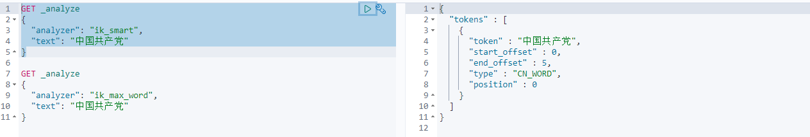
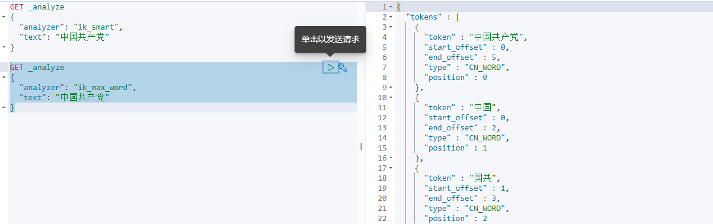
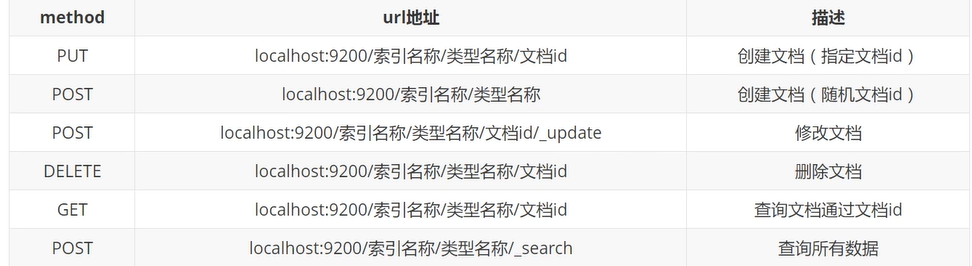
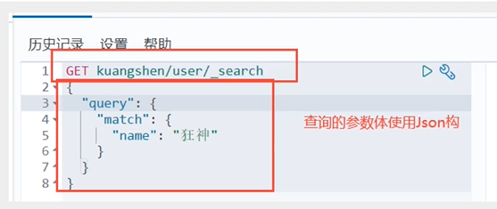
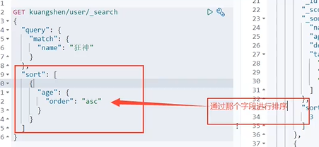
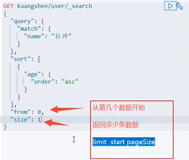
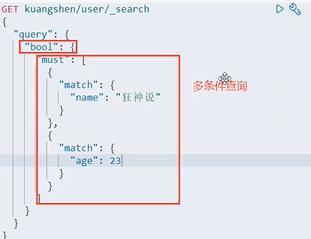

#### [ElasticSearch](https://www.bilibili.com/video/BV1BK411T713?from=search&seid=16953239209449126244)文件目录


#### 安装ik分词器 版本必须对应

ik_smart



ik_max_word



ik_smart和 ik_max_word的区别

ik_smart是最少切分，分词少，关键词准

ik_max_word,最细腻划分，

可以扩展分词器

#### **ElasticSearch初期可以理解为一个数据库**



举例

```javascript
PUT /test/type1/tx 

PUT /数据库名（索引）/以后不会使用（类型）/表名字（文档名）
```

#### 常用操作

```javascript
PUT /test/type1/tx 
{  
    "name" : "我是程序员",  
        "age": 18 
} 建表建值
```

```javascript
PUT /test2 
{  
	"mappings": {    
		"properties": {      
			"name":{        
				"type": "text"      
			},      
			"age":{        
				"type": "long"      
			},      
			"birthday":{        
				"type": "date"      
			}    
		}  
	} 
} 设置表的数据类型，建表操作


```

```javascript
GET /test 
查看数据库信息
```

查询



查询排序分页





多条件查询



关于分词查询

​	term，直接查询精确的

​	match，会使用分词器解析（先发现文档，通过分析的文档进行查询！）