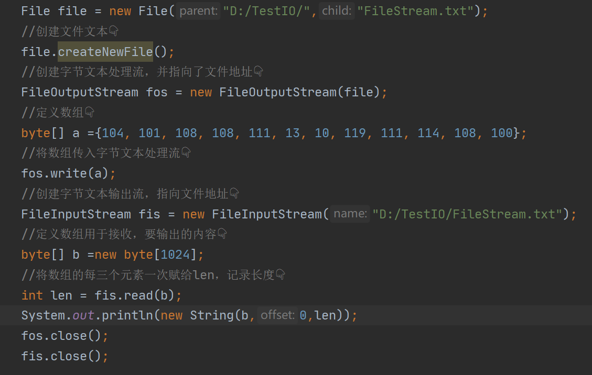
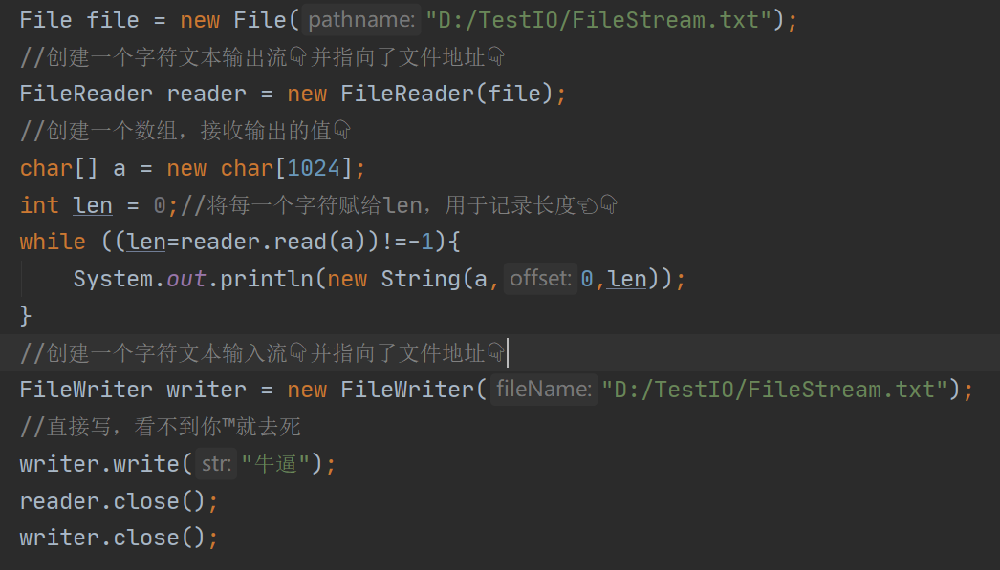
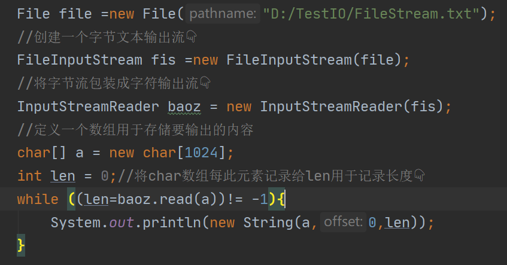
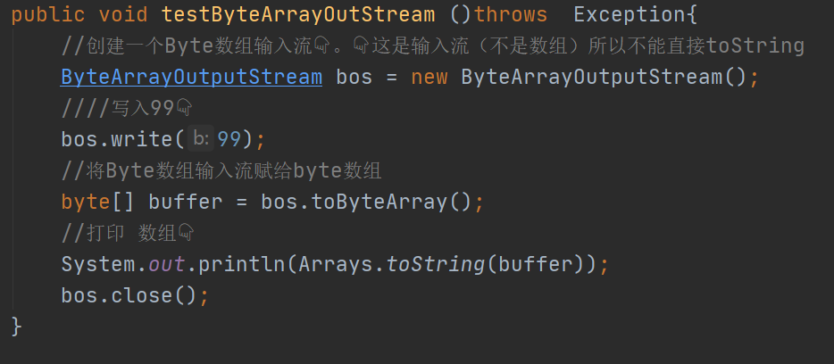
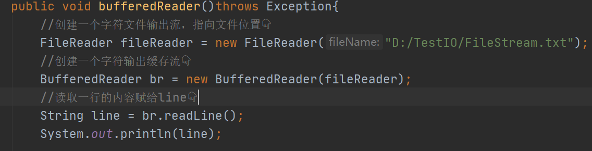

什么是IO流

IO流包括输入输出

输入：从外部，文件，数据库等地方以字节流或者字符流的方式读取数据

输出：将数据写入到外部，文件，数据库等以字节流或字符流的方式输出写入

字节流：可以处理一切数据

字符流：只能处理文本数据

处理文本流

FileInptutStream:文本的**输出**字节流

FileOutputStream文本的**输入**字节流

FileReader文本的**输出**字符流							ps：（1汉字=2字符）（1字符=3字节）

FileWriter文本的**输入**字符流

InputStreamReader:将字节流包装成字符流

OutStreamWriter:将字符流包装成字节流

ByteArrayOutputStream：Byte类型的数组输入流，只能用相对的类型区接收

ChaArrayOutputStream：同理，用相同类型接收该输入流

BufferedReader：字符缓存输出流		优势：它在内部已经定义了一个数组，我们不用再定义数组

BufferedReader：字符缓冲输入流		劣势：它们是字符流

字节打印流

字符打印流