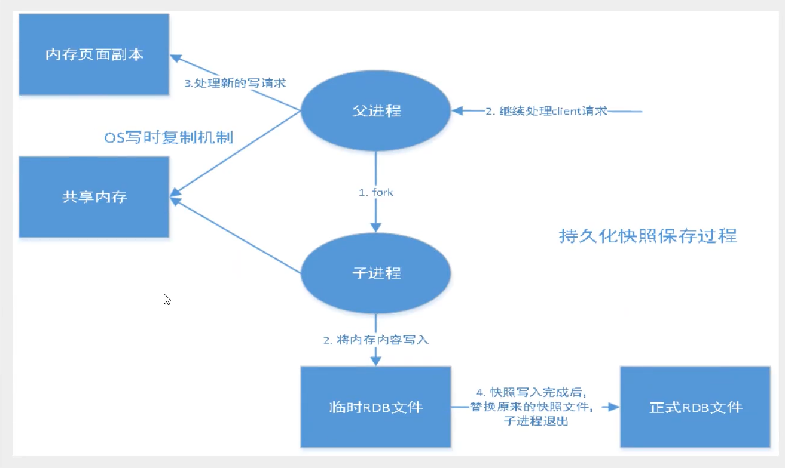
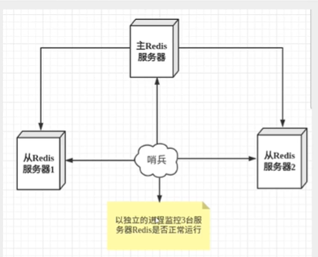
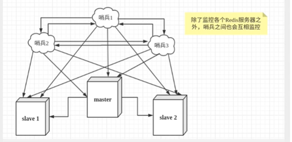

redis是单线程

因为速度很快，主要redis是基于内存操作的，cpu不是瓶颈

redis可以用作数据库，缓存，消息中间件MQ

支持的数据类型

```
String

List

Set

Hash

Zset
```

常见命令

```
ping 		查看是否成功 
set name 123 	添加数据k,v的形式 
get name		获取k 
keys *		查看数据库内容 
flushdb		清除数据库 
flushall		清除所有数据库 
select 1		切换数据库（有16个数据库默认是0号） 
type name	        查看当前k的类型 DBSIZE		查看当前数据库拥有多少k 
EXISTS name 1	判断k是否存在 
move name 1	移动到1号数据库 
EXPIRE name 	表示十秒后自动过期 
ttl name		查看剩余过期时间
```

String常见操作

```
APPEND name	  追加字符串 
STRLEN name	  查看字符串长度 
incrby name 5 自动加5 
decrby name 5 自动减5 
GETRANGE name 0 3	截取字符串（0 -1获取所有字符串） 
SETRANGE name 1 xx	从1的位置开始替换
```

List常见操作

```
lpush name        添加操作从左开始 
rpush name        添加操作从右开始 
lrange name 0 1   获取从下标0到1的值 
lpop name         移除左边第一个 
rpop name         移除右边第一个 
lindex name 5     获取下标5的值 
llen name         获取list的总长度 
lren name 1 西瓜  移除一个“西瓜” 精确移除
```

Set常用操作和

Zset是有序集合 所有的s变成z

```
sadd name 数据             添加值 
smembers name              查看指定set所有的值 
scard name                 查看元素的个数 
sismember name 数据         判断这个元素是否存在 
srem name 数据              移除元素
```

```
zrangebyscore name -inf +inf  withscores 显示所有用户从小到大显示并且显示数据 
zrangebyscore name 1 20  withscores 显示所有用户从小到大显示
```

Hash常用操作

key-map

 k-v（k-v）

```
hset name k v             添加值 
hget name k               获取值 
hmset name k1 v1 k2 k2    同时添加多个值 
hmget name k1 k2          同时查看多个值 
hgetall name              查看这个集合的所有值 
hdel name k               删除k 
hlen name                 查看这个集合中有多少值 
hexists namme k           查看这个v是否存在 
hkeys name                查看所有的k 
hvale name               查看所有的v 
hincrby name k             指定自动增加1，-1表示自减 
hsetnx name k v          如果已经存在值，不设置，不存在就设置值
```

Redis事务没有隔离级别概念

```
回顾mysql事务 
脏读：a读到了未提交的事务，比如a工资1000读取到工资9000，但是财务失误改错还未提交，第二天财务提交数据a又变会1000 不可重复读：a读取数据的时候，没操作完，b操作数据，并且提交，此时a再读发现数据发生变化 
幻读：a读表里有10条数据，b开始插入数据，a再读时发现数据不一致，产生幻觉 

解决办法 
DEFAULT 使用数据库设置的隔离级别 ( 默认 ) ，由 DBA 默认的设置来决定隔离级别
READ_UNCOMMITTED 会出现脏读、不可重复读、幻读 ( 隔离级别最低，并发性能高 ) 
READ_COMMITTED 会出现不可重复读、幻读问题（锁定正在读取的行） 
REPEATABLE_READ 会出幻读（锁定所读取的所有行） 
ERIALIZABLE 保证所有的情况不会发生（锁表）
```

```
回顾悲观锁乐观锁 
	悲观锁    
		很悲观，认为什么时候都会出现问题，无论做什么都会加锁 
	乐观锁    
		很乐观，认为什么都不会出现问题，所有不上锁，更新数据的时候去判断，version是否一致，才加锁    
		获取version    
		更新的时候比较version
```

Redis单条命令保证原子性，但事务不保证原子性

Redis最简单保证数据安全

​	开启事务（multi）

​	命令入队（set.get...）

​	关闭事务（exec）

​	说明：执行multi是所有的命令不执行，exec后会一条一条的执行


可以通过乐观锁实现事务

​	redis的watch命令可以作为乐观锁使用，、

​	另一个线程操作完成后，

​	那么exec会执行失败

​	最后完成后unwatch解锁


save 60 5		六十秒内操作了5次数据，就会生成持久化文件（快照策略）

持久化RDB,AOF

RDB36j



触发机制

​	save的规则满足的情况下，会生成rdb持久化文件

​	执行flushall命令，会生成rdb持久化文件

​	退出redis，会生成rdb持久化文件

优点

​	适合大规模数据恢复

​	对数据完整性不高

缺点

​	配置save需要根据业务场景，多次测试

​	fork进程会占用一定内存

AOF

​	是一个操作日志记录的文件

​	默认redis是关闭的，要打开

```
appendonly yes 打开aof 
appendfsync alwys 每次操作都记录，消耗性能 
appendfsync everysec 每一秒记录，可能会丢失1秒的数据
```

优点

​	每次修改都会同步数据，数据完整性好

缺点

​	aof性能消耗高

​	单机哨兵模式



哨兵模式



redis缓存穿透和雪崩

​	缓存穿透

​		概念：一个用户查询，发现redis缓存未命中，就会去数据库查询，如果是秒杀场景，千万条数据同时打到持久层，数据库可能直接瘫痪造成整个系统崩溃

​			解决办法：

​				布隆过滤器

​				缓存空对象

​	缓存击穿（缓存过期，热点信息）

​		概念：和穿透类似，虽然能命中redis缓存，但是再缓存过期的0.1s时候，就会大量的热点用户请求，数据库造成服务器瘫痪

​			解决办法：

​				设置缓存不过期

​				加互斥锁，分布式锁，保证只能一个线程访问数据库

​	缓存雪崩

​		概念：redis宕机，断网，或者缓存在某个时间集体失效

​			解决办法：

​				停掉一些服务，比如在双11的场景下，会停掉一些服务，保留核心服务

​				redis高可用，搭建集群，多架设几台redis

​				限流以及降级

​				数据预热，先提做好缓存，提前做好缓存过期时间