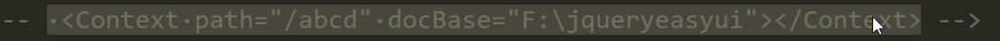

servlet是一套规范

tomcat 部署三种方式：

1，放在webapps建一个目录里放入WEB-INF文件包含web.xml

2，可放在root放入WEB-INF文件包含web.xml

1，2配置web.xml配置如下：

3，在tomcat目录里的conf的servlet.xml文件配置如下

server实例化标签说明

参数接收方式

getParameter接收值为String

getParameterValues接收值为String[]数组

getParameterNmaes所有值的name，接收值为数组，枚举

getParameterMap接收值为Map<key=values>

doGET：数据暴露在url链接上，数据传输有限制

doPost：相对GET安全，数据无限制

乱码

乱码出现的原因：编码与解码不一致

解决问题如下

HttpServlet体系结构

servlet生命周期

servlet生命周期会产生

1，加载servlet并实例化

实例化时机

1.第一次访问servlet

2.配置web.xml（<load-no-startup>填写优先级数字</load-no-startup>）

打开容器的时候执行

实例化一次

servlet线程不安全

servlet 访问计数：

serlet分布式计数：

2，初始化

初始化时机

1.第一次访问servlet

2.配置web.xml（<load-no-startup>填写优先级数字</load-no-startup>）

打开容器的时候执行

初始化一次

存在两init方法

3，提供服务

doget

dopost

4，销毁

容器关闭会执行销毁

重定向和转发

客户端跳转

resp.sendRedirect("suc.html")

重定向地址栏发送改变

zs.html

O------->

suc.html

服务端跳转

resp.getRequestDispatcher("suc.html").forward(req.resp)

转发地址栏没有改变,一次请求

O------->zs.html------>suc.html

servlet常用api

servlet3.0新特性

