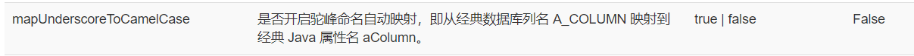
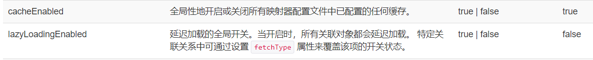
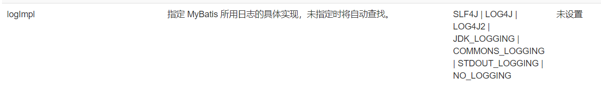
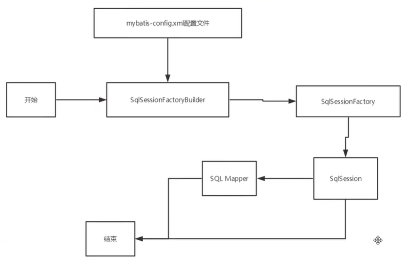
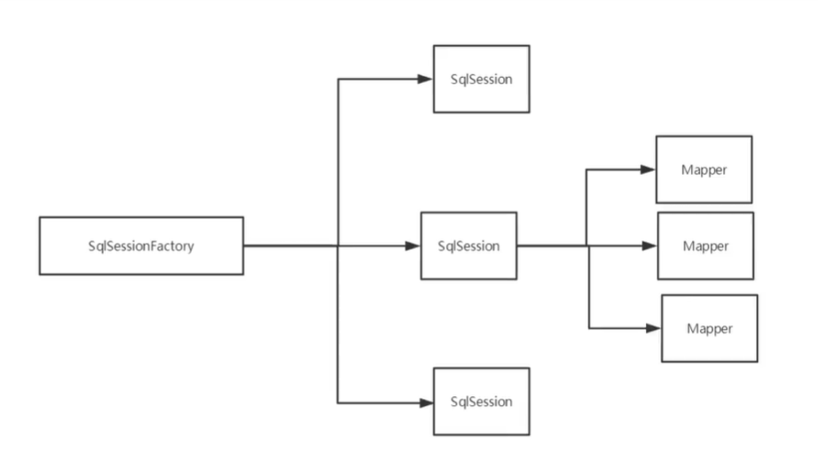
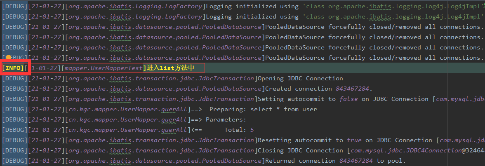
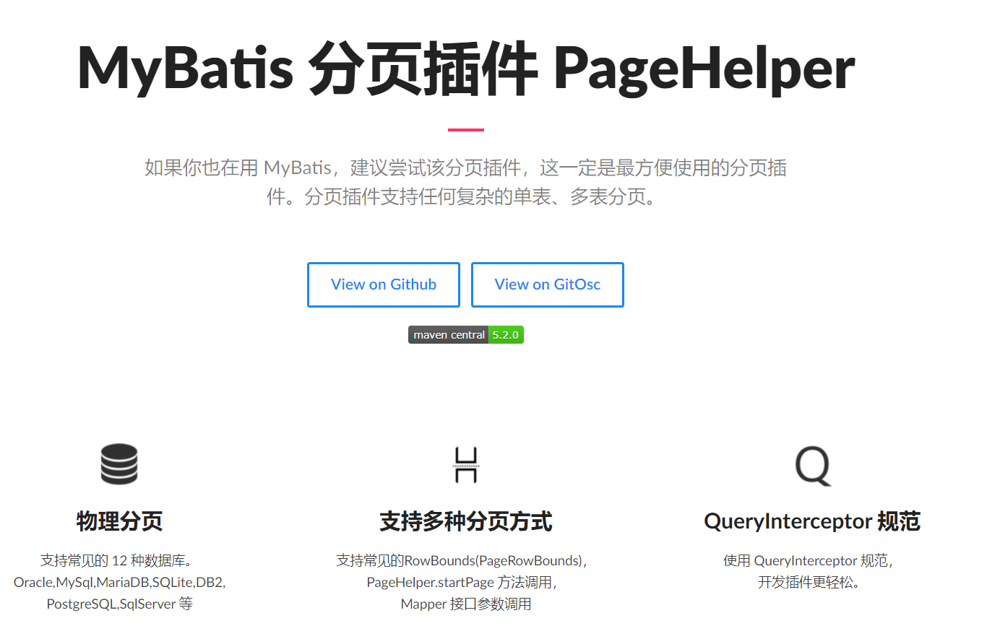
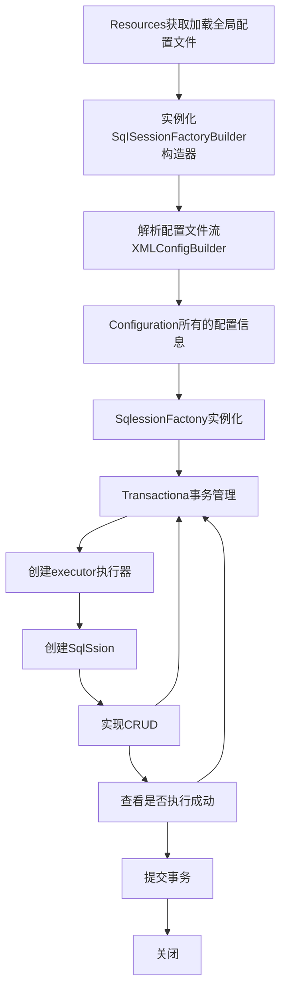

### Mybatis

#### 1、简介

##### 1.1、 什么是mybatis

- MyBatis 是一款优秀的**持久层框架**
- 它支持自定义 SQL、存储过程以及高级映射。
- MyBatis 免除了几乎所有的 JDBC 代码以及设置参数和获取结果集的工作。
- MyBatis 可以通过简单的 XML 或注解来配置和映射原始类型、接口和 Java POJO（Plain Old Java Objects，普通老式 Java 对象）为数据库中的记录。
- MyBatis 本是apache的一个[开源项目](https://baike.baidu.com/item/开源项目/3406069)iBatis, 2010年这个[项目](https://baike.baidu.com/item/项目/477803)由apache software foundation 迁移到了[google code](https://baike.baidu.com/item/google code/2346604)，并且改名为MyBatis 。
- 2013年11月迁移到[Github](https://baike.baidu.com/item/Github/10145341)。

##### 1.2 、持久化

数据持久化

- 持久化就是将程序的数据在持久状态和瞬时状态转化的过程
- 内存：断电即失
- 持久库(jdbc)，io文件持久化

##### 1.3、持久层

Dao层，Service层，Controller层......

- 完成持久化工作的代码块
- 层界十分明显

##### 1.4、为什么需要Mybatis？

- 帮助程序员将数据存入到数据库中
- 方便
- 传统JDBC代码太复杂了。简化。框架。自动化。
- 不用Mybatis可以。更容易上手。技术没有高低之分

优点

- 简单易学：本身就很小且简单。没有任何第三方依赖，最简单安装只要两个jar文件+配置几个sql映射文件易于学习，易于使用，通过文档和源代码，可以比较完全的掌握它的设计思路和实现。
- 灵活：mybatis不会对应用程序或者数据库的现有设计强加任何影响。 sql写在xml里，便于统一管理和优化。通过sql语句可以满足操作数据库的所有需求。
- 解除sql与程序代码的耦合：通过提供DAO层，将业务逻辑和数据访问逻辑分离，使系统的设计更清晰，更易维护，更易单元测试。sql和代码的分离，提高了可维护性。
- 提供映射标签，支持对象与数据库的orm字段关系映射
- 提供对象关系映射标签，支持对象关系组建维护
- 提供xml标签，支持编写动态sql。

#### 2、mybatis搭建

##### 2.1、搭建环境

搭建数据库

```mysql
#建库
CREATE DATABASE bjmybatis;
use bjmybatis;
#建表
CREATE TABLE user(
#NOT NULL PRIMARY KEY不为空并设为主键
#DEFAULT NULL可以是空
 id INT(20) NOT NULL PRIMARY KEY,
 name VARCHAR(30) DEFAULT NULL,
 pwd VARCHAR(30) DEFAULT NULL
)ENGINE=INNODB DEFAULT CHARSET=utf8;

#插入测试数据
INSERT INTO `user`(id,name,pwd)VALUES
(1,'南瓜','123'),
(2,'北瓜','123'),
(3,'冬瓜','123'),
(4,'西瓜','123')
```

导入依赖

```xml
<!--导入依赖-->
    <dependencies>
<!--        mysql驱动-->
        <dependency>
            <groupId>mysql</groupId>
            <artifactId>mysql-connector-java</artifactId>
            <version>5.1.46</version>
        </dependency>
<!--        junit-->
        <dependency>
            <groupId>junit</groupId>
            <artifactId>junit</artifactId>
            <version>4.12</version>
        </dependency>
<!--        mybatis-->
        <dependency>
            <groupId>org.mybatis</groupId>
            <artifactId>mybatis</artifactId>
            <version>3.5.2</version>
        </dependency>
    </dependencies>
```

##### 2.2、创建模块

model层

```java
package cn.kgc.model;
public class User {
    private Integer id;
    private String name;
    private String pwd;
    public Integer getId() {
        return id;
    }
    public void setId(Integer id) {
        this.id = id;
    }
    public String getName() {
        return name;
    }
    public void setName(String name) {
        this.name = name;
    }
    public String getPwd() {
        return pwd;
    }
    public void setPwd(String pwd) {
        this.pwd = pwd;
    }
    @Override
    public String toString() {
        return "User{" +
                "id=" + id +
                ", name='" + name + '\'' +
                ", pwd='" + pwd + '\'' +
                '}';
    }
}
```

mapper（dao）层

```java
public interface UserMapper {
    List<User> querAll();
}
```

mybatis核心配置文件（mybatisconfig.xml）

```xml
<?xml version="1.0" encoding="UTF-8" ?>
<!DOCTYPE configuration
        PUBLIC "-//mybatis.org//DTD Config 3.0//EN"
        "http://mybatis.org/dtd/mybatis-3-config.dtd">
<!--configuration总配置文件-->
<configuration>
    <environments default="development">
        <environment id="development">
            <transactionManager type="JDBC"/>
            <dataSource type="POOLED">
                <property name="driver" value="com.mysql.jdbc.Driver"/>
                <property name="url" value="jdbc:mysql://127.0.0.1:3306/bjmybatis"/>
                <property name="username" value="root"/>
                <property name="password" value="a123"/>
            </dataSource>
        </environment>
    </environments>
   <!--每一个mapper.xml都需要在mybatis核心配置文件中注册！--> 
    <mappers>
        <mapper resource="mapper/UserMapper.xml"/>
    </mappers>
</configuration>
```

UserMapper.xml(具体sql语句)

```xml
<?xml version="1.0" encoding="UTF-8" ?>
<!DOCTYPE mapper
        PUBLIC "-//mybatis.org//DTD Mapper 3.0//EN"
        "http://mybatis.org/dtd/mybatis-3-mapper.dtd">
<!--namespace绑定相对应的mapper接口-->
<mapper namespace="cn.kgc.mapper.UserMapper">
    <select id="querAll" resultType="cn.kgc.model.User">
    select * from user
  </select>
</mapper>
```

```java
public class MybatisUtils {
    private static SqlSessionFactory sqlSessionFactory;
    static {
        try {
            //使用mybatis的第一步:获取到SqlSessionFactory对象
            String resource ="mybatis-config.xml";
            InputStream inputStream = Resources.getResourceAsStream(resource);
            sqlSessionFactory = new SqlSessionFactoryBuilder().build(inputStream);
        } catch (IOException e) {
            e.printStackTrace();
        }
    }
//拿到SqlSession
//SqlSession就包含了面向数据库执行sql命令的所有方法
    public static SqlSession getSqlSession(){
        return sqlSessionFactory.openSession();
    }
}   
```

##### 2.3、CRUD

```xml
<!--namespace绑定相对应的mapper接口-->
<mapper namespace="cn.kgc.mapper.UserMapper">
```

resultType （将查询结果返回给接口的类型）

parameterType（接受接口的类型）

1、select

```xml
<select id="getById" resultType="cn.kgc.model.User">
	select * from user where id=#{id}
</select>
```

2、insert

```xml
<insert id="add" parameterType="cn.kgc.model.User">
	insert into user  (name,pwd) values(#{name},#{pwd});
</insert>
```

3、update

```xml
<update id="update" parameterType="cn.kgc.model.User">
	update user set name=#{name},pwd=#{pwd} where id=#{id}
</update>

```

4、delete

```xml
<delete id="delet" parameterType="int">
	delete from user where id=#{id}
</delete>
```

万能Map

假设，实体类，或数据库中表，字段或参数过多，将考虑使用map；

mapper接口

```java
User getByIdMap(Map <String,Object> map);
```

mapper.xml

```xml
<select id="getByIdMap" parameterType="map" resultType="cn.kgc.model.User">
	select * from user where id=#{UserId}
</select>
```

test调用mapper方法

```java
public void getByIdMap(){
    SqlSession sqlSession =MybatisUtils.getSqlSession();
    UserMapper mapper = sqlSession.getMapper(UserMapper.class);
  
    Map<String,Object> map = new HashMap<String,Object>();
    map.put("UserId",6);

    User byIdMap = mapper.getByIdMap(map);
    System.out.println(byIdMap);
  
    sqlSession.close();
}
```

模糊查询

mapper接口

```java
List<User>getByIdList(String value);
```

mapper.xml

```xml
<select id="getByIdList" resultType="cn.kgc.model.User">
	select * from user where name like "%"#{value}"%"
</select>
```

test调用

```java
public void getByIdList(){
    SqlSession sqlSession =MybatisUtils.getSqlSession();
    UserMapper mapper = sqlSession.getMapper(UserMapper.class);

    List<User> user = mapper.getByIdList("瓜");
    for (User user1 : user) {
        System.out.println(user1);
    }
    sqlSession.close();
}
```

两种方案拼接通配符%%

在java中

```java
 List<User> user = mapper.getByIdList("%瓜%");
```

在sql中

```mysql
 select * from user where name like "%"#{value}"%"
```

#### 4、配置解析

```
properties（属性）
settings（设置）
typeAliases（类型别名）
typeHandlers（类型处理器）
objectFactory（对象工厂）
plugins（插件）
environments（环境配置）
environment（环境变量）
transactionManager（事务管理器）
dataSource（数据源）
databaseIdProvider（数据库厂商标识）
mappers（映射器）
```

##### 4.1、properties引入外部文件

xml

```xml
<properties resource="db.properties"/>
```

db.properties

```properties
driver=com.mysql.jdbc.Driver
url=jdbc:mysql://localhost:3306/bjmybatis
usernameE=root
passwor=a123
```

##### 4.2、typeAliases 类型别名

###### 4.2.1diy别名

```xml
<!--    可以给实体类起别名-->
<typeAliases>
	<typeAlias type="cn.kgc.model.User" alias="User"/>
</typeAliases>
```

###### 4.2.2以实体类取别名

```xml
<typeAliases>
	<typeAlias type="cn.kgc.model.User"/>
</typeAliases>
```

4.2.3注解（在实体类注解）和2.2搭配使用

```java
@Alias("user")
public class User {}
```

##### 4.3、settings 设置

###### 驼峰标识



###### 缓存和懒加载(延迟加载)



###### 日志打印



以上是常用设置。具体设置https://mybatis.org/mybatis-3/zh/configuration.html#settings

#### 5、其他设置

- typeHandlers（类型处理器）
- objectFactory（对象工厂）
- plugins（插件）mybatis-puls

#### 6、mappers映射器

```xml
mybatis-config.xml中配置扫包
<mappers>
    <mapper resource="mapper/UserMapper.xml"/>
</mappers>
```

#### 7、生命周期和作用域



生命周期，作用域，是至关重要，错误的使用会严重影响并发问题

**SqlSessionFactoryBuilder（工厂。比如解析xml）**

- 一旦创建了 SqlSessionFactory，就不再需要它了
- 局部变量

**SqlSessionFactory（可以想象是一个连接池）**

- 可以想象它是一个：数据库连接池
- **一旦被创建就应该在应用的运行期间一直存在，没有任何理由丢弃它或重新创建另一个实例。**
- 因此 SqlSessionFactory 的最佳作用域是应用作用域
- 最简单的就是使用**单例模式**或者静态单例模式。

**SqlSession（写sql）**

- 个人使用（连接到连接池的一个请求）
- 个人使用（关闭，提交）
- 实例不是线程安全的，因此是不能被共享的（用完就关闭）否则占用资源
- 官方说明（比如 Servlet 框架中的 HttpSession。 如果你现在正在使用一种 Web 框架，考虑将 SqlSession 放在一个和 HTTP 请求相似的作用域中）



这里面每一个mapper就代表一个具体是业务，（操作数据库的方法crud）

#### 8、扩展

resultMap解决实体类属性名和数据库字段不一致问题

##### 结果集映射

```xml
<resultMap id="userMap" type="User">
<!--    column数据库中的字段    property实体类中的字段-->
    <result column="id" property="id"></result>
    <result column="name" property="name"></result>
    <result column="pwd" property="password"></result>
  </resultMap>
```

##### 日志

###### Log4j

- Log4j是[Apache](https://baike.baidu.com/item/Apache/8512995)的一个开源项目，通过使用Log4j，我们可以控制日志信息输送的目的地是[控制台](https://baike.baidu.com/item/控制台/2438626)、文件、[GUI](https://baike.baidu.com/item/GUI)组件
- 我们也可以控制每一条日志的输出格式；
- 通过定义每一条日志信息的级别，我们能够更加细致地控制日志的生成过程。
- 这些可以通过一个[配置文件](https://baike.baidu.com/item/配置文件/286550)来灵活地进行配置，而不需要修改应用的代码。

###### 导包

```xml
<!-- https://mvnrepository.com/artifact/log4j/log4j -->
<dependency>
    <groupId>log4j</groupId>
    <artifactId>log4j</artifactId>
    <version>1.2.17</version>
</dependency>
```

###### log4j.properties

```properties
#将等级为DEBUG的日志信息输出到console和file这两个目的地，console和file的定义在下面的代码
log4j.rootLogger=DEBUG,console,file

#控制台输出的相关设置
log4j.appender.console = org.apache.log4j.ConsoleAppender
log4j.appender.console.Target = System.out
log4j.appender.console.Threshold=DEBUG
log4j.appender.console.layout = org.apache.log4j.PatternLayout
log4j.appender.console.layout.ConversionPattern=[%c]-%m%n

#文件输出的相关设置
log4j.appender.file = org.apache.log4j.RollingFileAppender
log4j.appender.file.File=./log/speike.log
log4j.appender.file.MaxFileSize=10mb
log4j.appender.file.Threshold=DEBUG
log4j.appender.file.layout=org.apache.log4j.PatternLayout
log4j.appender.file.layout.ConversionPattern=[%p][%d{yy-MM-dd}][%c]%m%n

#日志输出级别
log4j.logger.org.mybatis=DEBUG
log4j.logger.java.sql=DEBUG
log4j.logger.java.sql.Statement=DEBUG
log4j.logger.java.sql.ResultSet=DEBUG
log4j.logger.java.sql.PreparedStatement=DEBUG
```

###### mybatis-config.xml

```xml
<settings>
    <setting name="logImpl" value="LOG4J"/>
</settings>
```

简单使用

在这个类中设置静态logger

```java
static Logger logger = Logger.getLogger(UserMapperTest.class);
```

在执行到这个类中的方法的时候会打印在./log/spike.log日子里

```java
logger.info("进入list方法中");
```



##### 分页

目的：减少数据处理量

###### 使用limit分页（sql分页）

接口

```java
List<User> querAllLimit(Map<String, Object> map);
```

mapper中的sql

```xml
<select id="querAllLimit" resultMap="userMap" parameterType="map">
	select * from user limit #{startIndex},#{pageSize}
</select>
```

测试

```java
  public void listlimit(){
//        第一步获取sqlsession
        SqlSession sqlSession = MybatisUtils.getSqlSession();
        logger.info("进入listlimit方法中");
//        第二步拿到querAll
        UserMapper mapper = sqlSession.getMapper(UserMapper.class);
        Map<String,Object> map = new HashMap<String,Object>();
        map.put("startIndex",0);
        map.put("pageSize",1);
        List<User> users = mapper.querAllLimit(map);
        System.out.println(users);
//        第三步关闭sqlSession
        sqlSession.close();
    }

```

###### 使用RowBounds分页（由java代码实现分页）

不建使用，因为违反了优化处理数量的问题

接口

```java
List<User> querRowBounds();
```

mapper中的sql

```xml
<!--分页RowBounds-->
<select id="querRowBounds" resultMap="userMap">
	select * from user
</select>
```

测试

```java
 @Test
    public void querRowBounds(){
//        第一步获取sqlsession
        SqlSession sqlSession = MybatisUtils.getSqlSession();
        logger.info("进入listlimit方法中");
//        第二步拿到querAll
        UserMapper mapper = sqlSession.getMapper(UserMapper.class);
        RowBounds rowBounds = new RowBounds(0,1);
        List<User> objects = sqlSession.selectList("cn.kgc.mapper.UserMapper.querRowBounds", null, rowBounds);
        System.out.println(objects);
//        第三步关闭sqlSession
        sqlSession.close();
    }
```

###### Mybatis分页插件（PageHelper）



不如自己用limit

#### Mybatis详细执行流程


