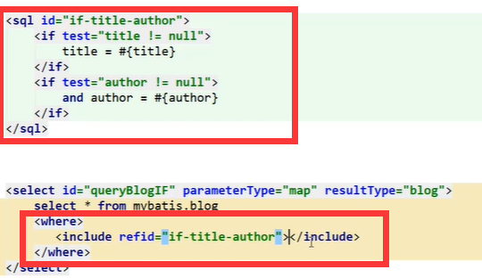

#### 1、注解CRUD

实体类和表字段一定要保持一致才能使用

```java
  @Select("select * from user")
    List<User> querAll();
//id查询操作
    @Select("select * from user where id=#{aid}")
    User getById(@Param("aid") Integer id);
//添加
    @Insert("insert into user  (name,pwd) values(#{name},#{password});")
    int add(User user);
//更新
    @Update("update user set name=#{name},pwd=#{password} where id=#{id}")
    int update(User user);
//删除
    @Delete(" delete from user where id=#{sid}")
    int delet(@Param("sid") Integer id);
```

#### 2、多对一练习

多个学生对应一个老师

学生表

```java
private Integer id;
private String name;
private Teacher teacher;
```

老师表

```java
private Integer id;
private String name;
```

第一种

```xml
<resultMap id="studentMap" type="cn.kgc.model.Student">
    <result column="id" property="id"></result>
    <result column="name" property="name"></result>
    <association column="tid" property="teacher" javaType="cn.kgc.model.Teacher" select="getById"></association>
</resultMap>

<select id="querAll" resultMap="studentMap">
    select * from student
</select>
<select id="getById" resultType="cn.kgc.model.Teacher">
    select * from teacher where id = #{id}
</select>
```

第二种

```xml
<resultMap id="studentMap2" type="cn.kgc.model.Student">
    <result property="id" column="sid" ></result>
    <result  property="name" column="sname"></result>
    <association property="teacher" javaType="cn.kgc.model.Teacher">
        <result property="id"  column="tid" ></result>
        <result  property="name" column="tname"></result>
    </association>
</resultMap>

<select id="querAll2" resultMap="studentMap2">
    select s.id sid ,s.name sname,t.id tid,t.name tname from student s ,teacher t where s.tid =t.id
</select>
```

#### 3、一对多练习

一个老师对于多个学生

学生

```java
private Integer id;
private String name;
private Integer tid;
```

老师

```java
private Integer id;
private String name;
private List<Student> students;
```

第一种

```xml
 <select id="querAll" resultMap="teachermap"
 select s.id sid ,s.name sname,t.id tid,t.name tname from student s ,teacher t where s.tid = #{id}
    </select>
    <resultMap id="teachermap" type="cn.kgc.model.Teacher">
        <result property="id" column="tid"></result>
        <result property="name" column="tname"></result>
<!--        复杂属性 association表示对象
                    collection表示集合， ofType表示集合中的泛型
                    比如List<Student>中的Student-->
        <collection property="students" ofType="cn.kgc.model.Student">
            <result property="id" column="sid"></result>
            <result property="name" column="sname"></result>
            <result property="tid" column="tid"></result>
        </collection>
    </resultMap>
```

第二种

有两个Sql

```xml
<resultMap id="teachermap2" type="cn.kgc.model.Teacher">
        <result property="id" column="id"></result>
        <result property="name" column="name"></result>
<!--        重点是这个sql传给他的值是老师id    column="id"-->
        <collection property="students" javaType="ArrayList" ofType="Student" select="getStudentteacher" column="id"></collection>
    </resultMap>
    <select id="querAll2" resultMap="teachermap2">
        select * from  teacher where id = #{id}
    </select>
    <select id="getStudentteacher" resultType="cn.kgc.model.Student">
        select * from  student where tid =#{id}
    </select>
```

#### 4、动态SQL

4.1、动态SQL-IF语句（条件查询）：有标签的就查标签，有作者就查作者。假如都有就查询

看sql前面有没有**wher 1=1**否则 有问题 报错。使用4.2

**实例:判断字段，并查询有的字段，没有就查询所有**

接口

```java
List<Blog> queryBlogIF(Map map);
```

mapper

```xml
<select id="queryBlogIF" parameterType="map" resultType="cn.kgc.model.Blog">
    select * from  blog where 1=1
    <if test="title != null" >
        and title=#{title}
        </if>
    <if test="author != null" >
        and author=#{author}
        </if>
</select>
```

测试

​    

```java
    public void queryBlogIF(){
        SqlSession sqlSession = MybatisUtils.getSqlSession();
        BlogMapper mapper = sqlSession.getMapper(BlogMapper.class);

        HashMap map = new HashMap();
//        map.put("title","Java");
        map.put("author","狂神说");

        List<Blog> blogs = mapper.queryBlogIF(map);
        for (Blog blog:blogs) {
            System.out.println(blog);
        }
        logger.info("----------------------------");
        sqlSession.close();
    }
```

4.2where/otherwise(都不满足走otherwise)		**本质自动删除	AND/OR**

**实例:判断字段，并查询有的字段** 都不满足走otherwise

```xml
<select id="queryBlogIF" parameterType="map" resultType="cn.kgc.model.Blog">
    select * from  blog
<where>
 <choose>
        <if test="title != null" >
        and title=#{title}
        </if>
    <if test="author != null" >
        and author=#{author}
        </if>
   <otherwise>
   and author =#{author }
   </otherwise>
 </choose>
</where>
</select>
```

4.3set（更新传有字段的数据）**本质自动删除逗号**

实例:判断字段，并更新有的字段

```xml
<update id="updateBlog" parameterType="cn.kgc.model.Blog">
    update blog
    <set>
        <if test="title != null" >
           title=#{title},
        </if>
        <if test="author != null" >
            author=#{author}
        </if>
    </set>
    where id=#{id}
</update>

```

4.4 SQL片段（作用sql中**IF判断**代码**重复过多**，可以抽取出来多地方使用）

使用



**注意事项：不能做太复杂的事情，建议单表使用！**

4.4Foreach

实例：查询一个或者多个id

接口

```java
List<Blog> queryBlogForeach(Map map);
```

mapper

```xml
<select id="queryBlogForeach" parameterType="map" resultType="cn.kgc.model.Blog">
    select *from blog
    <where>
        <foreach collection="ids" item="id" open="and (" close=")" separator="or">
            id = #{id}
        </foreach>
    </where>
</select>

```

测试

```java
public void queryBlogForeach(){
    SqlSession sqlSession = MybatisUtils.getSqlSession();
    BlogMapper mapper = sqlSession.getMapper(BlogMapper.class);
    HashMap map = new HashMap();
    ArrayList arrayList = new ArrayList();
    arrayList.add(1);
    arrayList.add(2);
    arrayList.add(4);
    map.put("ids",arrayList);
    List<Blog> blogs = mapper.queryBlogForeach(map);
    for (Blog blog: blogs) {
        System.out.println(blog);
    }
    sqlSession.close();
}

```

#### 5、Mybatis缓存

一级缓存

是sqlSession 级别的缓存。sqlSession.close()，sqlSession.commit()则失效。

默认开启

二级缓存

- 是namespace级别缓存，在接口内所有方法实现有效，白话：**在mapper接口的方法才生效**
- 需要手动开启
- namespace缓存会遗传到一级缓存中

第一步：**mybatis-config.xml**中

```xml
<settings>
    <setting name="cacheEnabled" value="true"/>
</settings>
```

第二部**mapper.xml**中

```xml
<cache
  eviction="FIFO"
  flushInterval="60000"
  size="512"
  readOnly="true"/>
```


- eviction:

- LRU – 最近最少使用：移除最长时间不被使用的对象。
- FIFO – 先进先出：按对象进入缓存的顺序来移除它们。
- SOFT – 软引用：基于垃圾回收器状态和软引用规则移除对象。
- WEAK – 弱引用：更积极地基于垃圾收集器状态和弱引用规则移除对象。

- flushInterval（刷新间隔）属性可以被设置为任意的正整数，设置的值应该是一个以毫秒为单位的合理时间量。 默认情况是不设置，也就是没有刷新间隔，缓存仅仅会在调用语句时刷新。
- size（引用数目）属性可以被设置为任意正整数，要注意欲缓存对象的大小和运行环境中可用的内存资源。默认值是 1024。
- readOnly（只读）属性可以被设置为 true 或 false。只读的缓存会给所有调用者返回缓存对象的相同实例。 因此这些对象不能被修改。这就提供了可观的性能提升。而可读写的缓存会（通过序列化）返回缓存对象的拷贝。 速度上会慢一些，但是更安全，因此默认值是 false。

**开启缓存需要序列化实体类**

```java
implements Serializable
```

