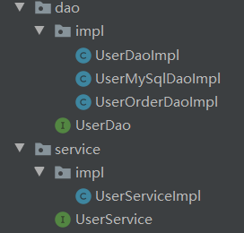
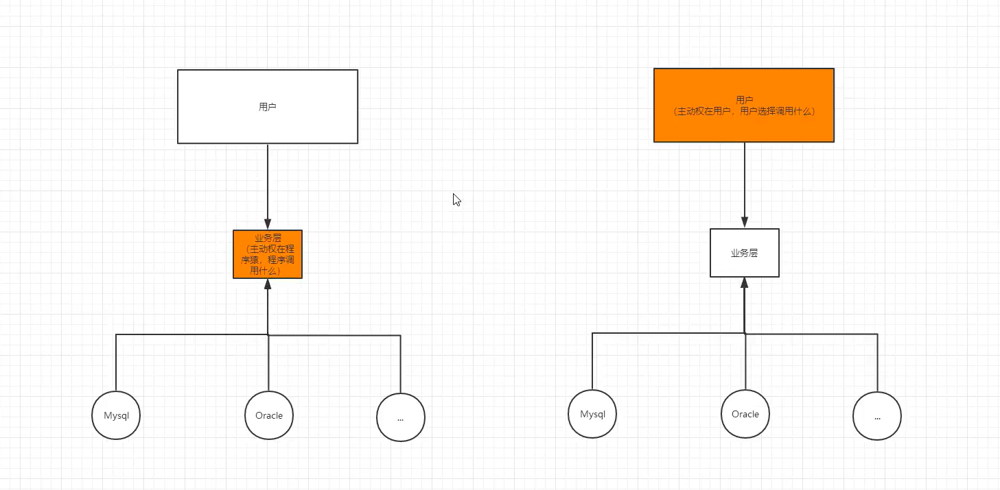
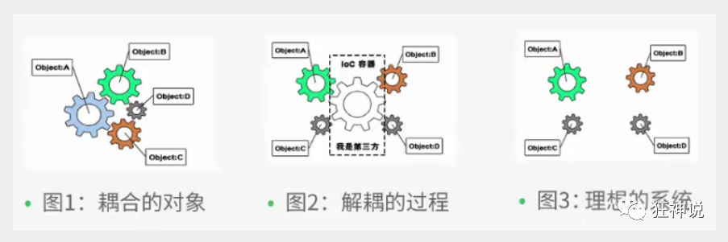
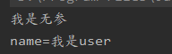
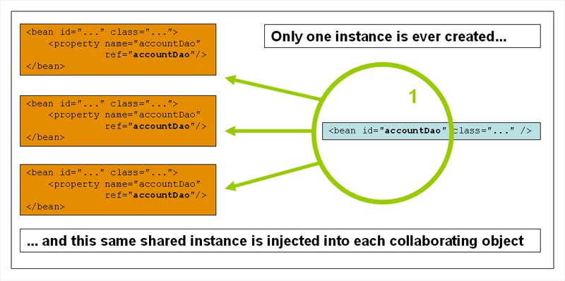
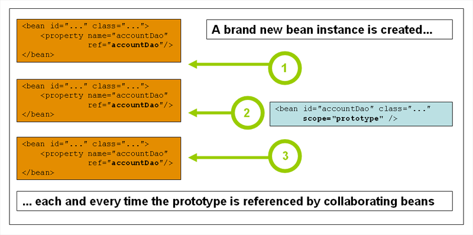
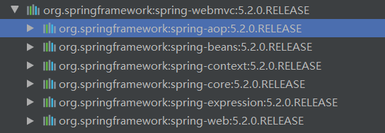

### 1、Spring简介

#### 1.1、方便解耦，简化开发

通过Spring提供的IoC容器，我们可以将对象之间的依赖关系交由Spring进行控制，避免硬编码所造成的过度程序耦合。有了Spring，用户不必再为单实例模式类、属性文件解析等这些很底层的需求编写代码，可以更专注于上层的应用。

#### 1.2、AOP[编程](https://baike.baidu.com/item/编程)**的支持**

通过Spring提供的[AOP](https://baike.baidu.com/item/AOP)功能，方便进行面向切面的编程，许多不容易用传统OOP实现的功能可以通过AOP轻松应付。

#### 1.3、[声明式事务](https://baike.baidu.com/item/声明式事务)**的支持**

在Spring中，我们可以从单调烦闷的事务管理代码中解脱出来，通过声明式方式灵活地进行事务的管理，提高开发效率和质量。

#### 1.4、方便程序的测试

可以用非容器依赖的编程方式进行几乎所有的测试工作，在Spring里，测试不再是昂贵的操作，而是随手可做的事情。例如：Spring对Junit4支持，可以通过注解方便的测试Spring程序。

#### 1.5、方便集成各种优秀框架

Spring不排斥各种优秀的开源框架，相反，Spring可以降低各种框架的使用难度，Spring提供了对各种优秀框架（如Struts,Hibernate、Hessian、Quartz）等的直接支持。

#### 1.6、降低Java EE API的使用难度

Spring对很多难用的Java EE API（如JDBC，JavaMail，远程调用等）提供了一个薄薄的封装层，通过Spring的简易封装，这些Java EE API的使用难度大为降低。

​	**Spring是一个轻量级的控制反转(IoC)和面向切面(AOP)的容器（框架）。//红色**


###  2、IOC理论推导

#### 2.1、set注入原理

目录结构



以前是控制权在userServiceImpl，去实现具体的某一个dao，**主动**

```java
private UserDao userDao = new UserDaoImpl ;

public static void main(String[] args) {
    UserService userService = new UserServiceImpl();    
    userService.get(); 
}
```

使用set注入后，控制权在 用户手上。实现具体的dao在main方法中去定义(所以叫**控制反转**)**被动**

```java
public class UserServiceImpl implements UserService {
    private UserDao userDao ; 
    //利用set方法实现动态的注入userdao的各种实现   
    public void setUserDao(UserDao userDao) {this.userDao = userDao;}
    public void get() {userDao.get();} 
}
```

```java
public static void main(String[] args) {
    UserService userService = new UserServiceImpl();
    ((UserServiceImpl) userService).setUserDao(new UserOrderDaoImpl());    
    userService.get(); 
}
```

这种思想，从本质上解决了问题，系统大大的降低了耦合度高，可以更加专注的在业务的实现上，这就是IOC原型！



#### 2.2、IOC本质

**控制反转IoC(Inversion of Control)，是一种设计思想，DI(依赖注入)是实现IoC的一种方法**，也有人认为DI只是IoC的另一种说法。没有IoC的程序中 , 我们使用面向对象编程 , 对象的创建与对象间的依赖关系完全硬编码在程序中，对象的创建由程序自己控制，控制反转后将对象的创建转移给第三方，个人认为所谓控制反转就是：获得依赖对象的方式反转了。



**IOC是Spring框架的核心内容**，使用多种方式完美的实现了IoC，可以使用XML配置，也可以使用注解，新版本的Spring也可以零配置实现IoC。

### 3、快速上手Spring

实体类

```java
package cn.kgc.entity; 
public class Hello {
    private String str;
    public String getStr() {return str;}    
    public void setStr(String str) {this.str = str;}    
    @Override    
    public String toString() {
        return "Hello{" +
            "str='" + str + '\'' +
            '}';    
    } 
}
```

beans.xml（Spring配置文件）

```xml
<?xml version="1.0" encoding="UTF-8"?>
<beans xmlns="http://www.springframework.org/schema/beans"       				 xmlns:xsi="http://www.w3.org/2001/XMLSchema-instance"       xsi:schemaLocation="http://www.springframework.org/schema/beans       http://www.springframework.org/schema/beans/spring-beans.xsd"> 
    <!--使用spring来创建对象，在spring中这些都叫bean
    java中new对象
        类型 变量名= new 类型();
    Hello hello = new Hello();
    bean中new对象
        id = 变量名
        class = new 类型;
        property 相对与给对象中的属性设置一个值-->
    <bean id="hello" class="cn.kgc.entity.Hello">
        <property name="str" value="Spring你好"></property>
    </bean> 
</beans>
```

启动类

```java
 public static void main(String[] args) {
     //        获取spring配置文件中的上下文对象        
     ApplicationContext context = new ClassPathXmlApplicationContext( "beans.xml"); 
     //        对象都由spring管理，需要的时候从spring中获取（context）        
     Hello hello = (Hello) context.getBean("hello");        
     System.out.println(hello);    
 }

```

### 4、分析IOC创建对象

**无参:不用传参数，spring默认走无参构造，所有创建对象没障碍**

**有参:必须要传参数才能创建对象，不然程序无法分辨是否是有参或者无参**

使用无参构造方法创建对象。默认！

```java
User user = (User) beans.getBean("user"); 
user.show();
```



使用有参创建对象

设置有参数方式,不是方法中的参数

1、参数名字(就这个其他不用看)最实用

```xml
<!--        通过参数名设置-->        
<constructor-arg name="name" value="我是无参"></constructor-arg>
```

2、下标赋值

```xml
<!--        当前index表示有参的第几个参数（从0开始）--> 
<constructor-arg index="0" value="我是有参"></constructor-arg>
```

3、参数类型

```xml
<!--        不建议使用,如果第二参数类型相同就不行--> 
<constructor-arg type="java.lang.String" value="我是有参"></constructor-arg>
```

总结:当配置文件加载的时候,spring就已经帮我们初始化好对象了

### 5、Spring配置

##### 5.1、 别名

```xml
<!--    添加了别名也可以用别名，从beans中取出，不代表原来的名字失效（id）-->
<alias name="user" alias="userNE"></alias>
```

##### 5.2、Beans配置

```xml
<!--    id:bean的唯一标识，相对于SpringIOC中对象的名字
        class:bean对象的全路径
        name:也是别名 ，可以取多个别名
        property 属性
        value:赋值
        ref:引用spring配置文件中的,然后赋值 -->
<bean id="user" class="cn.kgc.entity.User" name="user2,user3">
    <property name="name" value="我是user"></property>    
</bean>
```

##### 5.3、import

一般用于团队开发

将beans.xml合并

applicationConetext.xml

```xml
<import resource="beans1.xml"/> 
<import resource="beans2.xml"/> 
<import resource="beans3.xml"/>
```

当bean.xml文件中id有重名的情况

Srping会自动判断是否对象相同,相同的合并

还有就是体现到别名的重要性了，bean中的name取别名很简单，而且可以多个别名，ioc会自动判断

### 6、依赖注入

#### 6.1、构造器注入

​	在4、分析IOC创建对象案例中

#### 6.2、Set注入【重点】

依赖注入：set注入

- - 依赖：bean创建对象依赖容器

  - 注入：bean对象的所有属性，由容器来注入

##### 环境搭建

###### 	实体类

​		Student

```java
public class Student {
    private String name;
    private Address address;
    private String[] books;
    private List<String> hobbys;
    private Map<String,String> card;
    private Set<String> games;
    private String wife;
    private Properties info;
}
```

###### Address

```
public class Address {
private String address;
}
```

###### 测试

```java
public static void main(String[] args) {
    ApplicationContext context = new ClassPathXmlApplicationContext("applicationContext.xml");
    Student student = (Student) context.getBean("student");    
    System.out.println(student.toString()); 
}
```

###### 配置注入

包含所有类型注入（map，list，set.......）

```xml
<bean class="cn.kgc.entity.Address" id="address">
        <property name="address" value=""/>
    </bean>
    <bean id="student" class="cn.kgc.entity.Student">
<!--        普通注入-value-->
        <property name="name" value="西瓜"/>
<!--        Bean注入-ref-->
        <property name="address" ref="address"/>
<!--        数组注入 -->
        <property name="books">
            <array>
                <value>水浒传</value>
                <value>西游记</value>
                <value>红楼梦</value>
                <value>三国</value>
            </array>
        </property>
<!--        list注入-->
        <property name="hobbys">
            <list>
                <value>学习Spring</value>
                <value>练琴</value>
                <value>听歌</value>
                <value>看电影</value>
            </list>
        </property>
        
<!--        map注入-->
        <property name="card">
            <map>
                <entry key="身份证" value="51000000000"/>
                <entry key="银行卡" value="51000000000"/>
            </map>
        </property>

<!--        set-->
        <property name="games">
            <set>
                <value>LOL</value>
                <value>GTA5</value>
                <value>PUBG</value>
            </set>
        </property>

<!--        NULL-->
        <property name="wife">
            <null/>
        </property>

<!--        Properties就是连接数据库用的-->
        <property name="info">
            <props>
                <prop key="学号">200</prop>
                <prop key="性别">男</prop>
                <prop key="年龄">19</prop>
            </props>
        </property>
    </bean>
```

最终效果

```javascript
Student{
    String                    name='西瓜', 
    Address                   address=Address{address=''}, 
    String[]                  books=[水浒传, 西游记, 红楼梦, 三国], 
    List<String>              hobbys=[学习Spring, 练琴, 听歌, 看电影], 
    Map<String,String>        card={身份证=51000000000, 银行卡=51000000000}, 
    Set<String>               games=[LOL, GTA5, PUBG], 
    String                    wife='null', 
    Properties：连接数据库对象 info={学号=200,性别=男,年龄=19}}
```

#### 6.3、拓展注入（需要导入）

p命名空间：简写set的注入方式 。p = property

```xml-dtd
xmlns:p="http://www.springframework.org/schema/p"
```

示例

```xml
 <bean name="john-classic" class="com.example.Person">
        <property name="name" value="John Doe"/>
        <property name="spouse" ref="jane"/>
    </bean>

    <bean name="john-modern"
        class="com.example.Person"
        p:name="John Doe"
        p:spouse-ref="jane"/>
```

c命名空间：简写构造器的注入方式

```xml-dtd
xmlns:c="http://www.springframework.org/schema/c"
```

示例

```xml-dtd
<bean id="beanOne" class="x.y.ThingOne">
        <constructor-arg name="thingTwo" ref="beanTwo"/>
        <constructor-arg name="thingThree" ref="beanThree"/>
        <constructor-arg name="email" value="something@somewhere.com"/>
</bean>

    <!-- c命名空间 -->
<bean id="beanOne" class="x.y.ThingOne" c:thingTwo-ref="beanTwo"
 c:thingThree-ref="beanThree" c:email="something@somewhere.com"/>
```

1、单例模式（Spring默认机制）

```xml-dtd
<bean id="user" class="cn.kgc.user" scope="singleton"/>
```



2、原型模式：每次从容器中get的时候，都会产生一个新对象！（性能不好）并发没问题

```xml-dtd
<bean id="user" class="cn.kgc.user" scope="prototype"/>
```



### 7、Bean自动装配

ByName自动装配

```xml-dtd
<bean id "cat" class"cn.kgc.entity.Cat" autowire ="byname"></bean>
<bean id "dog" class"cn.kgc.entity.Dog" autowire ="byname"></bean>

    <!--byName: 会自动在容器上下文中查找，和当前对象set方法后面值对应的beanid-->
<bean id "people" class"cn.kgc.entity.people" autowire ="byname">
 <property name ="name" value="名字"></property>
</bean>
```

ByType自动装配

```xml-dtd
<bean  class"cn.kgc.entity.Cat" autowire ="byname"></bean>
<bean  class"cn.kgc.entity.Dog" autowire ="byname"></bean>
    <!--byType: 会自动在容器上下文中查找，和当前对象属性类型相同的Bean！-->
<bean id "people" class"cn.kgc.entity.people" autowire ="byname">
 <property name ="name" value="名字"></property>
</bean>
```

小结：

- 在byName的时候，需要保证所有bean的id唯一，并且bean需要和自动注入的属性的set方面名一致
- 在byType的时候，需要保证所有bean的class唯一，并且bean需要和自动注入的属性的类型一致！

#### 7.1使用注解实现自动装配

jdk1.5.Spring2.5后支持

```xml-dtd
<?xml version="1.0" encoding="UTF-8"?>
<beans xmlns="http://www.springframework.org/schema/beans"
       xmlns:xsi="http://www.w3.org/2001/XMLSchema-instance"
       xmlns:context="http://www.springframework.org/schema/context"
       xsi:schemaLocation="http://www.springframework.org/schema/beans
       http://www.springframework.org/schema/beans/spring-beans.xsd
       http://www.springframework.org/schema/context
       http://www.springframework.org/schema/context/spring-context.xsd">
<context:annotation-config/>
</beans>
```

```java
@Autowired
private Cat cat;
@Autowired
@Qualifier(value = "dog")
private Dog dog;
private String name;
```

使用@Qualifier(value = "xxx")配合@Autowired使用，指一个唯一bean的id对象注入

比如；多个dog对象，指定具体某一个dog对象

一个顶俩@Resource（name=“xxx”），但是没有Spring高级，尽量使用Spring自动装配注解

小结：@Resource和@Autowired区别

- 都是用来自动装配的，都可以放在属性字段上
- @Autowired通过byname的方式实现，而且需要要求这个对象存在！【常用】
- @Resource默认通过byname的方式实现，如果找不到名字，则通过bytype实现！如果两种方式都找不到就报错【常用】

### 8、使用注解开发

在spring4之后，使用注解开发，必须导入aop的包



在applicationcontext.xml中需要导入context的约束，增加注解的支持

详细配置看（7.1使用注解自动装配）

#### 8.1、bean

#### 8.2、属性如何注入

```java
//加入beans中等于xml中的 <bean class="cn.kgc.entity.User" id="user"></bean>
@Component
public class User {
    //注入属性 等于xml中的 <property name="name" value="我是人"/>
    @Value("我是人")
    public String name;
}
```

#### 8.3、衍生的注解

@Component有几个衍生注解，

- dao【@Repository】
- controller【@Controller】
- service【@Service】

效果一样，只是好分辨层与层之间的关系

#### 8.4、自动装配配置（详细参考7.1）

```java
@Autowired//或者@Resource(name="cat")
private Cat cat;
@Autowired
@Qualifier(value = "dog")
private Dog dog;
private String name;
```

#### 8.5、作用域

@Scope("singleton")默认”单例

@Scope("prototype")原型。

这个注解写在哪自己心里有点b数哈

#### 8.6、小结

xml和注解

xml更加万能

注解更加方便

最佳使用

xml用来管理bean

注解负责完成属性的注入，说白了xml扫包就行了

```javascript
<!--   记得这个才生效 扫描指定路径下的包，注解才能生效-->
    <context:component-scan base-package="cn.kgc"/>
    <context:annotation-config/>
```


### 9、JavaConfig实现配置

#### config类

```java
//@Configuration表示一个配置类，就和bean.xml一个效果
//@ComponentScan("cn.kgc")扫包
@Configuration
@ComponentScan("cn.kgc")
public class Config {
    //扫指定的包，名字是getUser全称,取的名字，在白痴的就是id中名字，别名......
    @Bean
    public User getUser(){
        return new User();//返回要注入到bean的对象
    }
}
```

#### 测试类

AnnotationConfig配置类（类名.class）

ClassPathXml配置文件（“配置文件”）

```java
public static void main(String[] args) {
    //如果用配置类就用AnnotationConfig获取配置类对象
    ApplicationContext context = new AnnotationConfigApplicationContext(Config.class);
    User getUser = context.getBean("getUser", User.class);
    System.out.println(getUser.name);ClassPathXmlApplicationContext
}
```

