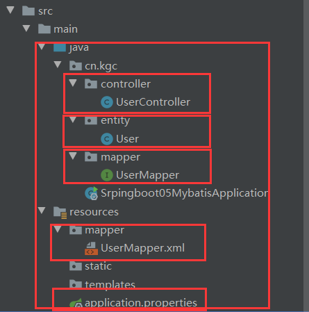

#### **Springboot整合mybatis(增删改查)**

##### 1、导入 MyBatis 所需要的依赖

```xml
<dependency>    
    <groupId>org.mybatis.spring.boot</groupId>    
    <artifactId>mybatis-spring-boot-starter</artifactId>    
    <version>2.1.1</version>
</dependency>
```

##### 2、配置数据库连接信息（不变）

```properties
spring.datasource.username=root
spring.datasource.password=a123
spring.datasource.url=jdbc:mysql://localhost:3306/bjmybatis?serverTimezone=UTC&useUnicode=true&characterEncoding=utf-8
spring.datasource.driver-class-name=com.mysql.cj.jdbc.Driver
#下面这两个配置，可以在每次连接的时候判断一些连接是否有效
#spring.datasource.druid.test-on-borrow=true
#spring.datasource.druid.test-while-idle=true

#整合mybatis
mybatis.type-aliases-package=cn.kgc.entity
mybatis.mapper-locations=classpath:mapper/*.xml
```

##### 3、mapper接口

```java
@Mapper//让mybatis识别
@Repository
public interface UserMapper {
    List<User> queryAll();
    User querById(int id);
    int addUser(User user);
    int updateUser(User user);
    int deleteUser(int id);
}
```

##### 4、sql

```xml
<?xml version="1.0" encoding="UTF-8" ?>
<!DOCTYPE mapper
        PUBLIC "-//mybatis.org//DTD Mapper 3.0//EN"
        "http://mybatis.org/dtd/mybatis-3-mapper.dtd">
<mapper namespace="cn.kgc.mapper.UserMapper">
    <select id="queryAll" resultType="cn.kgc.entity.User">
       select * from user;
    </select>

    <select id="querById" resultType="cn.kgc.entity.User" parameterType="int">
       select * from user where id = #{id};
    </select>

    <insert id="addUser" parameterType="cn.kgc.entity.User">
        insert into user (id,name,pwd) values (#{id},#{name},#{pwd})
    </insert>

    <update id="updateUser" parameterType="cn.kgc.entity.User">
        update user set name=#{name},pwd=#{pwd} where id=#{id}
    </update>

    <delete id="deleteUser" parameterType="int">
        delete from user where id=#{id}
    </delete>
</mapper>
```

##### 5、controller

```java
@RestController
public class UserController {
    @Autowired
    private UserMapper userMapper;

    @GetMapping("/list")
    public String list(){
        return  JSON.toJSONString(userMapper.queryAll());
    }

    @GetMapping("/byId/{id}")
    public String UserById(@PathVariable int id){
        return JSON.toJSONString(userMapper.querById(id));
    }

    @PostMapping("/adduser")
    public String addUser(User user){
        System.out.println(user);
        return JSON.toJSONString(userMapper.addUser(user));
    }

    @PostMapping("/updateUser")
    public String updateUser(User user){
        System.out.println(user);
        return JSON.toJSONString(userMapper.updateUser(user));
    }
    @GetMapping("/deleteUser/{id}")
    public String deleteUser(@PathVariable int id){
        return JSON.toJSONString(userMapper.deleteUser(id));
    }
}
```

项目结构

