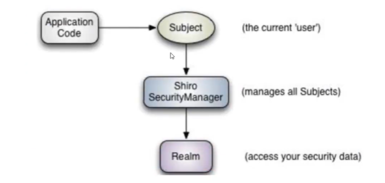

#### Shiro内部结构



##### 1、Springboot+Shiro+Mybatis（认证）

做了一个简单的授权（必须认证了才能访问）authc

1、 从页面中拿到用户名和密码

2、在Controller中封装用户名密码

3、userRealm中获取封装后的用户和密码

4、userRealm执行查询用户sql返回对象

5、userRealm返回对象后，拿到对象的密码

6、userRealm将对象的密码和封装后的密码做对比是否一致（shiro帮我们做）

​          

Controller执行了1、2

```java
@RequestMapping("/login")
public String login(String  username,String password, Model model){
    //获取当前用户
    Subject subject = SecurityUtils.getSubject();
    //封装用户数据
    UsernamePasswordToken toke = new UsernamePasswordToken(username,password);
    try{
        //使用try，catch抛出异常来判断用户是否成功或者失败.....
        subject.login(toke);
        return"index";
    }catch (UnknownAccountException e){//用户名错误
        model.addAttribute("msg","用户名错误");
        return "login";//返回登录页面重新登录
    }catch (IncorrectCredentialsException e){//密码错误
        model.addAttribute("msg","密码错误");
        return "login";//返回登录页面重新登录
    }
}
```

自定义UserRealm	执行了3、4、5、6

```java
//自定义的Realm
public class UserRealm extends AuthorizingRealm {
    @Autowired
    private UserMapper userMapper;
    //授权
    @Override
    protected AuthorizationInfo doGetAuthorizationInfo(PrincipalCollection principalCollection) {
        System.out.println("执行了---------授权doGetAuthorizationInfo");
        return null;
    }
    //认证
    @Override
    protected AuthenticationInfo doGetAuthenticationInfo(AuthenticationToken authenticationToken) throws AuthenticationException {
        System.out.println("执行了---------认证doGetAuthenticationInfo");
        //从controller中拿到用户名和密码
        UsernamePasswordToken userToken = (UsernamePasswordToken)authenticationToken;

        //从数据库查询用户名返回对象
        User user = userMapper.queryUserName(userToken.getUsername());

        if(user==null){//如果对象查询为空就return空
            return null;
        }
        //密码认证,shiro帮我们认证(userToken.getPassword()==user.getPwd())
        return new SimpleAuthenticationInfo("",user.getPwd(),"");
        
    }
}
```

```java
@Configuration
public class ShiroConfig {
    //ShiroFilterFactoryBean    ：3
    @Bean
    public ShiroFilterFactoryBean getShiroFilterFactoryBean(@Qualifier("getDefaultWebSecurityManager") DefaultWebSecurityManager defaultWebSecurityManager){
        ShiroFilterFactoryBean bean = new ShiroFilterFactoryBean();
        //设置安全管理器
        bean.setSecurityManager(defaultWebSecurityManager);
        //添加shiro的内置过滤器
        /*
            anon:   无需认证就可以访问
            authc:  必须认证了才能访问
            user:   必须拥有了 记住我 功能才能使用
            perms:  拥有对某个资源的权限才能访问
            role:   拥有某个角色权限才能访问
         */
        Map<String, String> filterMap = new LinkedHashMap<>();
        filterMap.put("/user/add","authc");
        filterMap.put("/user/update","authc");
        bean.setFilterChainDefinitionMap(filterMap);
        //设置登录请求
        bean.setLoginUrl("/tologin");
        return bean;
    }
    //DafaultWebSecurityManager     ：2
    @Bean
    public DefaultWebSecurityManager getDefaultWebSecurityManager(@Qualifier("userRealm") UserRealm userRealm){
        DefaultWebSecurityManager securityManager = new DefaultWebSecurityManager();
        //关联UserRealm
        securityManager.setRealm(userRealm());

        return securityManager;
    }
    //创建realm对象     ：1
    @Bean
    public UserRealm userRealm(){
        return new UserRealm();
    }
}
```


##### 2、Springboot+shiro+mybatis（授权）

 

第一步	ShiroFilterFactoryBean   授权模板：设置带有什么权限，才能访问那种请求，否则走未经授权页面

第二步	在自定义UserRealm的授权中从认证中拿到当前用户的信息user。拿到他的授权信息，并添加，返回inof

去设置授权模板比对，如果存在，成功则进入，返回未授权页面

```java
@Configuration
public class ShiroConfig {

    //ShiroFilterFactoryBean    ：3
    @Bean
    public ShiroFilterFactoryBean getShiroFilterFactoryBean(@Qualifier("getDefaultWebSecurityManager") DefaultWebSecurityManager defaultWebSecurityManager){
        ShiroFilterFactoryBean bean = new ShiroFilterFactoryBean();
        //设置安全管理器
        bean.setSecurityManager(defaultWebSecurityManager);
        //添加shiro的内置过滤器
        /*
            anon:   无需认证就可以访问
            authc:  必须认证了才能访问
            user:   必须拥有了 记住我 功能才能使用
            perms:  拥有对某个资源的权限才能访问
            role:   拥有某个角色权限才能访问
         */
        Map<String, String> filterMap = new LinkedHashMap<>();

        filterMap.put("/user/add","perms[user:add]");
        filterMap.put("/user/update","perms[user:update]");
        filterMap.put("/user/*","authc");
        bean.setFilterChainDefinitionMap(filterMap);
        //设置未登录后页面
        bean.setLoginUrl("/tologin");

        //设置未授权后页面
        bean.setUnauthorizedUrl("/noauth");

        return bean;
    }
    //DafaultWebSecurityManager     ：2
    @Bean
    public DefaultWebSecurityManager getDefaultWebSecurityManager(@Qualifier("userRealm") UserRealm userRealm){

        DefaultWebSecurityManager securityManager = new DefaultWebSecurityManager();
        //关联UserRealm
        securityManager.setRealm(userRealm());

        return securityManager;
    }
    //创建realm对象     ：1
    @Bean
    public UserRealm userRealm(){
        return new UserRealm();
    }
}
```

自定义的Realm

```java
//自定义的Realm
public class UserRealm extends AuthorizingRealm {
    @Autowired
    private UserMapper userMapper;
    //授权
    @Override
    protected AuthorizationInfo doGetAuthorizationInfo(PrincipalCollection principalCollection) {
        System.out.println("执行了---------授权doGetAuthorizationInfo");

        SimpleAuthorizationInfo inof = new SimpleAuthorizationInfo();
        //拿到认证中的对象，从里面拿到当前对象的授权信息
        Subject subject = SecurityUtils.getSubject();
        User user = (User) subject.getPrincipal();
        System.out.println("当前授权用户的权限信息+++++++++++++++++++"+user.getPerms());

        inof.addStringPermission(user.getPerms());

        return inof;
    }

    //认证
    @Override
    protected AuthenticationInfo doGetAuthenticationInfo(AuthenticationToken authenticationToken) throws AuthenticationException {
        System.out.println("执行了---------认证doGetAuthenticationInfo");
        //从controller中拿到用户名和密码
        UsernamePasswordToken userToken = (UsernamePasswordToken)authenticationToken;

        //从数据库查询用户名返回对象
        User user = userMapper.queryUserName(userToken.getUsername());

        if(user==null){//如果对象查询为空就return空
            return null;
        }

        //密码认证,shiro帮我们认证(userToken.getPassword()==user.getPwd())
        return new SimpleAuthenticationInfo(user,user.getPwd(),"");

        /*
Controller: 1、 从页面中拿到用户名和密码
            2、在controller中封装用户名密码

 UserRealm: 3、userRealm中获取封装后的用户和密码
            4、userRealm执行查询用户sql返回对象
            5、userRealm返回对象后，拿到对象的密码
            6、userRealm将对象的密码和封装后的密码做对比是否一致（shiro帮我们做）
         */
    }
}
```


##### 3、Springboot+shiro+mybatis+thymeleaf（授权）

目的：

1、只显示当前有权限的按钮

2、登录成功就不显示登录按钮

1、导包

```xml
<!--        shiro-thymeleaf整合-->
        <dependency>
            <groupId>com.github.theborakompanioni</groupId>
            <artifactId>thymeleaf-extras-shiro</artifactId>
            <version>2.0.0</version>
        </dependency>
```

2、将ShiroDialect放进bean容器中

```java
@Bean//整合ShiroDialect:用来整合整合Shiro thymeleaf
public ShiroDialect getShiroDialect(){
    return new ShiroDialect();
}
```

3、设置session	在UserRealm中的认证成功后添加session

```java
Subject ace=SecurityUtils.getSubject();
Session session = ace.getSession();
session.setAttribute("loginUser",user);
```

4、html代码

```html
<body>
<h1>首页</h1>
    <p th:text="${msg}"></p>
    //判断是否有session登录空就显示
    <div th:if="${session.loginUser==null}">
        <a th:href="@{/tologin}">登录</a>
    </div>
    //判断有user:add这个权限，才能显示按钮
    <div shiro:hasPermission="user:add">
    	<a th:href="@{/user/add}">add</a>
    </div>
    //判断有user:update这个权限，才能显示按钮
    <div shiro:hasPermission="user:update">
	    <a th:href="@{/user/update}">update</a>
    </div>
</body>
```

