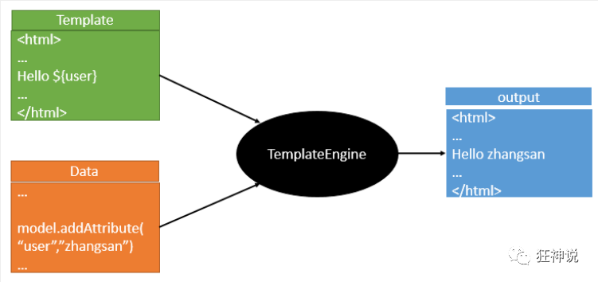

#### 回顾什么是Spring

Spring是一个开源框架，2003 年兴起的一个轻量级的Java 开发框架，作者：Rod Johnson 

#### Spring是如何简化Java开发的

为了降低Java开发的复杂性，Spring采用了以下4种关键策略：

1、基于POJO的轻量级和最小侵入性编程，所有东西都是bean；

2、通过IOC，依赖注入（DI）和面向接口实现松耦合；

3、基于切面（AOP）和惯例进行声明式编程；

4、通过切面和模版减少样式代码，RedisTemplate，xxxTemplate；

Spring Boot 基于 Spring 开发，Spirng Boot 本身并不提供 Spring 框架的核心特性以及扩展功能，只是用于快速、敏捷地开发新一代基于 Spring 框架的应用程序。也就是说，它并不是用来替代 Spring 的解决方案，而是和 Spring 框架紧密结合用于提升 Spring 开发者体验的工具。Spring Boot 以**约定大于配置的核心思想**（学会Sping思想），默认帮我们进行了很多设置，多数 Spring Boot 应用只需要很少的 Spring 配置。同时它集成了大量常用的第三方库配置（例如 Redis、MongoDB、Jpa、RabbitMQ、Quartz 等等），Spring Boot 应用中这些第三方库几乎可以零配置的开箱即用。

简单来说就是SpringBoot其实不是什么新的框架，它默认配置了很多框架的使用方式，就像maven整合了所有的jar包，spring boot整合了所有的框架 。

Spring Boot 出生名门，从一开始就站在一个比较高的起点，又经过这几年的发展，生态足够完善，Spring Boot 已经当之无愧成为 Java 领域最热门的技术。

#### Spring Boot的主要优点

- 为所有Spring开发者更快的入门
- **开箱即用**，提供各种默认配置来简化项目配置
- 内嵌式容器简化Web项目
- 没有冗余代码生成和XML配置的要求

#### 1、第一个SpringBoot程序

1、创建一个新项目

2、选择spring initalizr ， 可以看到默认就是去官网的快速构建工具那里实现

3、填写项目信息

4、选择初始化的组件（初学勾选 Web 即可）

5、填写项目路径

6、等待项目构建成功

**项目结构分析：**

通过上面步骤完成了基础项目的创建。就会自动生成以下文件。

1、程序的主启动类

2、一个 application.properties 配置文件

3、一个 测试类

4、一个 pom.xml

#### 2、Springboot配置文件yml，properties

###### xml配置

```xml
<server>    
    <port>8081<port>
</server>
```

###### yaml配置

```yaml
server：
	prot: 8080
```

yaml基础语法

说明：语法要求严格！

1、空格不能省略

2、以缩进来控制层级关系，只要是左边对齐的一列数据都是同一个层级的。

3、属性和值的大小写都是十分敏感的。

##### 2.1、yml配置文件基本用法

实体类

重点注解：@ConfigurationProperties(prefix = "person")

```java
/*
@ConfigurationProperties作用：
将配置文件中配置的每一个属性的值，映射到这个组件中；
告诉SpringBoot将本类中的所有属性和配置文件中相关的配置进行绑定
参数 prefix = “person” : 将配置文件中的person下面的所有属性一一对应
*/
@Component //注册bean
@ConfigurationProperties(prefix = "person")
public class Person {
    private String name;
    private Integer age;
    private Boolean happy;
    private Date birth;
    private Map<String,Object> maps;
    private List<Object> lists;
    private Dog dog;
}
```

IDEA 提示，springboot配置注解处理器没有找到，让我们看文档，我们可以查看文档，找到一个依赖！

```xml
<!-- 导入配置文件处理器，配置文件进行绑定就会有提示，需要重启 -->
<dependency>
    <groupId>org.springframework.boot</groupId>
    <artifactId>spring-boot-configuration-processor</artifactId>
    <optional>true</optional>
</dependency>
```

application.yml

```yaml
person:
  name: qinjiang
  age: 3
  happy: false
  birth: 2000/01/01
  maps: {k1: v1,k2: v2}
  lists:
    - code
    - girl
    - music
  dog:
    name: 旺财
    age: 1
```

测试类

```java
@Autowired
    private Person person;
    @Test
    void contextLoads() {
        System.out.println(person);
    }
```


##### 2.2、properties配置文件基本用法

重点注解：@PropertySource(value = "classpath:user.properties")

```java
@Component //注册bean
@PropertySource(value = "classpath:user.properties")
public class User {
    //直接使用@value
    @Value("${user.name}") //从配置文件中取值
    private String name;
    @Value("#{9*2}")  // #{SPEL} Spring表达式
    private int age;
    @Value("男")  // 字面量
    private String sex;
}
```

user.properties

```properties
user.name=kuangshen
user.age=18
user.sex=男
```

测试类。和yml测试类一致，打印输出

**结论：**

配置yml和配置properties都可以获取到值 ， 强烈推荐 yml；

如果我们在某个业务中，只需要获取配置文件中的某个值，可以使用一下 @value；

如果说，我们专门编写了一个JavaBean来和配置文件进行一一映射，

就直接@configurationProperties，不要犹豫！


JSR303数据校验说明：

```java
 @NotNull(message="名字不能为空")
    private String userName;
    @Max(value=120,message="年龄最大不能查过120")
    private int age;
    @Email(message="邮箱格式错误")
    private String email;

    空检查
    @Null       验证对象是否为null
    @NotNull    验证对象是否不为null, 无法查检长度为0的字符串
    @NotBlank   检查约束字符串是不是Null还有被Trim的长度是否大于0,只对字符串,且会去掉前后空格.
    @NotEmpty   检查约束元素是否为NULL或者是EMPTY.

   Booelan检查
    @AssertTrue     验证 Boolean 对象是否为 true
    @AssertFalse    验证 Boolean 对象是否为 false

    长度检查
    @Size(min=, max=) 验证对象（Array,Collection,Map,String）长度是否在给定的范围之内
    @Length(min=, max=) string is between min and max included.

    日期检查
    @Past       验证 Date 和 Calendar 对象是否在当前时间之前
    @Future     验证 Date 和 Calendar 对象是否在当前时间之后
    @Pattern    验证 String 对象是否符合正则表达式的规则
}
```

##### 2.3、多环境配置文件

###### properties配置激活某个环境的配置

application.properties		默认环境配置

application-test.properties 代表测试环境配置

application-dev.properties 代表开发环境配置

指定谋个环境在application.properties中配置

```properties
#比如在配置文件中指定使用dev环境，我们可以通过设置不同的端口号进行测试；
#我们启动SpringBoot，就可以看到已经切换到dev下的配置了；
spring.profiles.active=dev
```


###### yml配置激活某个环境的配置

 

```yaml
server:
    port: 8081       
    spring:
    profiles:
    active: prod #选择要激活那个环境块
---
server:
    port: 8083
    spring:
    profiles: dev #配置环境的名
---
server:
    port: 8084
    spring:
    profiles: prod  #配置环境的名
```


#### 3、Springboot-Web开发	

导入静态资源

首页，自定义

jsp，模板引擎	Thymeleaf

自动装配扩展SpringMVC	

增删改查

拦截器

国际化

##### 3.1、静态资源

总结:

1.在springboot，我们可以使用以下方式处理静态资源

o webjars 					访问：localhost:8080/webjars/

o public，static，resourcesl		访问：localhost:8080/

2.优先级: resources>static (默认) >public

**3.2、首页**

#### 4、模板引擎Thymeleaf

##### 4.1、简单描述模板引擎Thymeleaf

 模板引擎的作用就是我们来写一个页面模板，某些有些值呢，是动态的，我们写一些表达式。而这些值，从哪来呢，就是我们在后台封装一些数据。然后把这个模板和这个数据交给我们模板引擎，模板引擎按照我们这个数据帮你把这表达式解析，填充到我们指定的位置，然后把这个数据最终生成一个我们想要的内容给我们写出去，这就是我们这个模板引擎，不管是jsp还是其他模板引擎，都是这个思想。只不过呢，就是说不同模板引擎之间，他们可能这个语法有点不一样。其他的我就不介绍了，我主要来介绍一下SpringBoot给我们推荐的Thymeleaf模板引擎，这模板引擎呢，是一个高级语言的模板引擎，他的这个语法更简单。而且呢，功能更强大。



**简单的说	如图：将静态页面（template）+controller中的数据通过（data）**

**Thymeleaf模板引擎（templeateEngine）**

**渲染到用户访问的的动态页面（output）**

##### 4.2、Thymeleaf模板的基本用法（静态页面和controller绑定数据最终显示）

controller

```java
@RequestMapping("/t2")
public String test2(Map<String,Object> map){
    //存入数据
    map.put("msg","<h1>Hello</h1>");
    map.put("users", Arrays.asList("qinjiang","kuangshen"));
    return "test";
}
```

html

```html
<body>
<div th:text="${msg}"> </div>//取出数据
<div th:utext="${msg}"> </div>//取出数据并且判断数据中是否有标签并且应用上
<h3 th:each="user:${users}" th:text="${user}"></h3>//循环users数据，取名user，然后显示user
</body>
```

