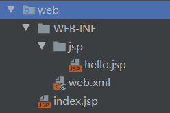
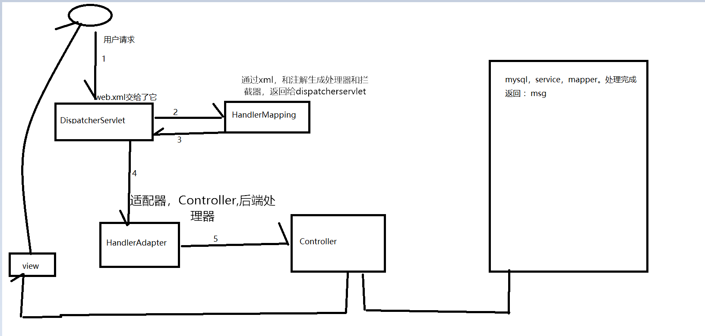
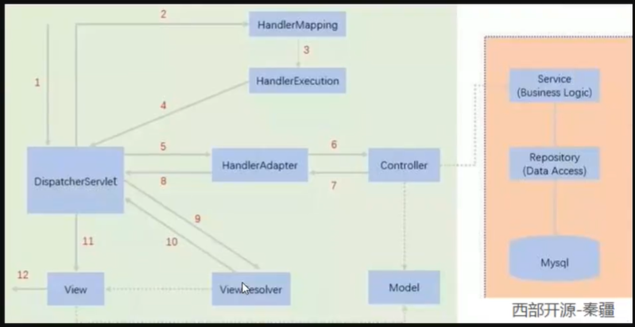
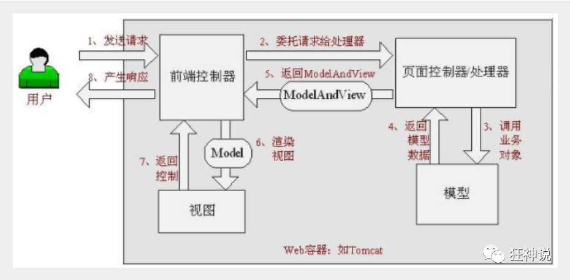
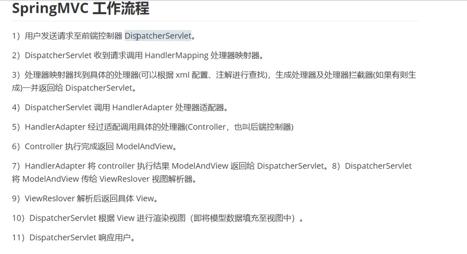
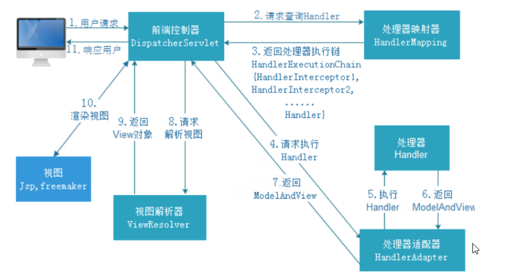
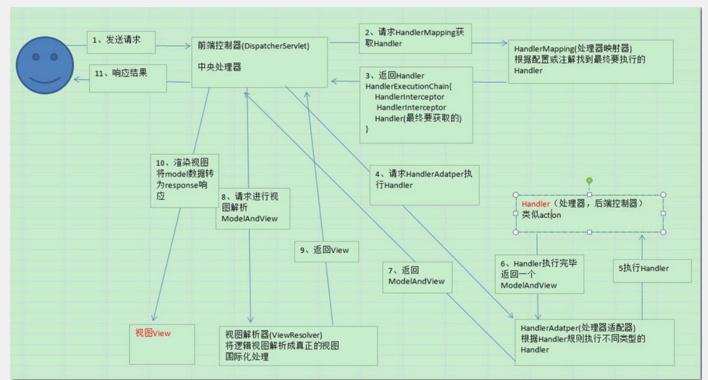

#### MVC模型

MVC：

模型层（dao，service，model）

控制层（Controller）

视图（jsp）



```xml-dtd
<?xml version="1.0" encoding="UTF-8"?>
<web-app xmlns="http://xmlns.jcp.org/xml/ns/javaee"
         xmlns:xsi="http://www.w3.org/2001/XMLSchema-instance"
         xsi:schemaLocation="http://xmlns.jcp.org/xml/ns/javaee http://xmlns.jcp.org/xml/ns/javaee/web-app_4_0.xsd"
         version="4.0">
    <servlet>
        <servlet-name>hello</servlet-name>
        <servlet-class>cn.kgc.HelloServlet</servlet-class>
    </servlet>
    <servlet-mapping>
        <servlet-name>hello</servlet-name>
        <url-pattern>/hello</url-pattern>
    </servlet-mapping>
    //初始界面
    <welcome-file-list>
        <welcome-file>index.jsp</welcome-file>
    </welcome-file-list>

</web-app>	
```

控制器（servlet）

```java
public class HelloServlet extends HttpServlet {
    @Override
    protected void doGet(HttpServletRequest req, HttpServletResponse resp) throws ServletException, IOException {
        String method = req.getParameter("method");
        if (method.equals("add")){
            req.getSession().setAttribute("msg","执行add方法");
        }
        if (method.equals("dele")){
            req.getSession().setAttribute("msg","执行dele方法");
        }
        //业务逻辑
        //视图跳转
        req.getRequestDispatcher("/WEB-INF/jsp/hello.jsp").forward(req,resp);
    }
    @Override
    protected void doPost(HttpServletRequest req, HttpServletResponse resp) throws ServletException, IOException {
        super.doGet(req, resp);
    }
}

```

####  Spring MVC的特点

1. ##### 轻量级，简单易学

2. ##### 高效 , 基于请求响应的MVC框架

3. ##### 与Spring兼容性好，无缝结合

4. ##### 约定优于配置

5. ##### 功能强大：RESTful、数据验证、格式化、本地化、主题等

6. ##### 简洁灵活

#### SpringMVC第一个程序（偏原理）

##### web.xml

```xml-dtd
<!--1.注册servlet-->
<servlet>
    <servlet-name>SpringMVC</servlet-name>
    <servlet-class>org.springframework.web.servlet.DispatcherServlet</servlet-class>
    <!--通过初始化参数指定SpringMVC配置文件的位置，进行关联-->
    <init-param>
        <param-name>contextConfigLocation</param-name>
        <param-value>classpath:springmvc-servlet.xml</param-value>
    </init-param>
    <!-- 启动顺序，数字越小，启动越早 -->
    <load-on-startup>1</load-on-startup>
</servlet>

<!--所有请求都会被springmvc拦截 -->
<servlet-mapping>
    <servlet-name>SpringMVC</servlet-name>
    <url-pattern>/</url-pattern>
</servlet-mapping>
```

##### springmvc-servlet.xml

```xml-dtd
<?xml version="1.0" encoding="UTF-8"?>
<beans xmlns="http://www.springframework.org/schema/beans"
       xmlns:xsi="http://www.w3.org/2001/XMLSchema-instance"
       xmlns:context="http://www.springframework.org/schema/context"
       xmlns:mvc="http://www.springframework.org/schema/mvc"
       xsi:schemaLocation="http://www.springframework.org/schema/beans
       http://www.springframework.org/schema/beans/spring-beans.xsd
       http://www.springframework.org/schema/context
       https://www.springframework.org/schema/context/spring-context.xsd
       http://www.springframework.org/schema/mvc
       https://www.springframework.org/schema/mvc/spring-mvc.xsd">
 
    <bean class="org.springframework.web.servlet.mvc.SimpleControllerHandlerAdapter"></bean>
    <bean class="org.springframework.web.servlet.handler.BeanNameUrlHandlerMapping"></bean>
    <!-- 视图解析器 -->
    <bean class="org.springframework.web.servlet.view.InternalResourceViewResolver"
          id="internalResourceViewResolver">
        <!-- 前缀 -->
        <property name="prefix" value="/WEB-INF/jsp/" />
        <!-- 后缀 -->
        <property name="suffix" value=".jsp" />
    </bean>

    <bean class="cn.kgc.controller.HelloController" id="/hello"></bean>
</beans>
```

##### HelloController 	

```xml-dtd
//注意导入Controller接口
public class HelloController implements Controller {

    public ModelAndView handleRequest(HttpServletRequest httpServletRequest, HttpServletResponse httpServletResponse) throws Exception {
        //ModelAndView模型和视图
        ModelAndView modelAndView = new ModelAndView();
        //封装对象，放入model中
        modelAndView.addObject("msg","HelloSpringMvc");
        //封装要跳转的视图，放到view中
        modelAndView.setViewName("hello");//：“/WEB-INF/jsp/hello.jsp”
        return modelAndView;
    }
}
```

#### SpringMVC请求过程(1)

1、用户请求网址>到web.xml，由于springmvc的DispatcherServlet拦截所有请求👇

```xml-dtd
<servlet>
    <servlet-name>SpringMVC</servlet-name>
    <servlet-class>org.springframework.web.servlet.DispatcherServlet</servlet-class>
    <!--通过初始化参数指定SpringMVC配置文件的位置，进行关联-->
    <init-param>
        <param-name>contextConfigLocation</param-name>
        <param-value>classpath:springmvc-servlet.xml</param-value>
    </init-param>
    <!-- 启动顺序，数字越小，启动越早 -->
    <load-on-startup>1</load-on-startup>
</servlet>

<!--所有请求都会被springmvc拦截 -->
<servlet-mapping>
    <servlet-name>SpringMVC</servlet-name>
    <url-pattern>/</url-pattern>
</servlet-mapping>
```

2、DispatcherServlet交给HandlerMapping处理用户请求

HandlerMapping（又名处理映射器）会匹配用户请求 找到对应bean的id的 Controller

```xml-dtd
<?xml version="1.0" encoding="UTF-8"?>
<beans xmlns="http://www.springframework.org/schema/beans"
       xmlns:xsi="http://www.w3.org/2001/XMLSchema-instance"
       xmlns:context="http://www.springframework.org/schema/context"
       xmlns:mvc="http://www.springframework.org/schema/mvc"
       xsi:schemaLocation="http://www.springframework.org/schema/beans
       http://www.springframework.org/schema/beans/spring-beans.xsd
       http://www.springframework.org/schema/context
       https://www.springframework.org/schema/context/spring-context.xsd
       http://www.springframework.org/schema/mvc
       https://www.springframework.org/schema/mvc/spring-mvc.xsd">
 
    <bean class="org.springframework.web.servlet.mvc.SimpleControllerHandlerAdapter"></bean>
    <bean class="org.springframework.web.servlet.handler.BeanNameUrlHandlerMapping"></bean>
    <!-- 视图解析器 -->
    <bean class="org.springframework.web.servlet.view.InternalResourceViewResolver"
          id="internalResourceViewResolver">
        <!-- 前缀 -->
        <property name="prefix" value="/WEB-INF/jsp/" />
        <!-- 后缀 -->
        <property name="suffix" value=".jsp" />
    </bean>

    <bean class="cn.kgc.controller.HelloController" id="/hello"></bean>
</beans>
```

3、HandlerMapping返回DispatcherServlet 指向HandlerAdapter（处理适配器）让 Controller 处理model和view

4，Controller 返回来后交给视图解析器去解析InternalResourceViewResolver。用很多引擎。这里就拼接路径和后缀









可以拷贝来用的springmvc(注解开发)

web.xml交给DispatcherServlet（拦截所有不包括.jsp）

```xml-dtd
<?xml version="1.0" encoding="UTF-8"?>
<web-app xmlns="http://xmlns.jcp.org/xml/ns/javaee"
         xmlns:xsi="http://www.w3.org/2001/XMLSchema-instance"
         xsi:schemaLocation="http://xmlns.jcp.org/xml/ns/javaee http://xmlns.jcp.org/xml/ns/javaee/web-app_4_0.xsd"
         version="4.0">
    <!--1.注册DispatcherServlet-->
    <servlet>
        <servlet-name>springmvc</servlet-name>
        <servlet-class>org.springframework.web.servlet.DispatcherServlet</servlet-class>
        <!--关联一个springmvc的配置文件:【servlet-name】-servlet.xml-->
        <init-param>
            <param-name>contextConfigLocation</param-name>
            <param-value>classpath:springmvc-servlet.xml</param-value>
        </init-param>
        <!--启动级别-1-->
        <load-on-startup>1</load-on-startup>
    </servlet>

    <!--/ 匹配所有的请求；（不包括.jsp）-->
    <!--/* 匹配所有的请求；（包括.jsp）-->
    <servlet-mapping>
        <servlet-name>springmvc</servlet-name>
        <url-pattern>/</url-pattern>
    </servlet-mapping>
</web-app>
```

springmvc-servlet.xml

```xml-dtd
<?xml version="1.0" encoding="UTF-8"?>
<beans xmlns="http://www.springframework.org/schema/beans"
       xmlns:xsi="http://www.w3.org/2001/XMLSchema-instance"
       xmlns:context="http://www.springframework.org/schema/context"
       xmlns:mvc="http://www.springframework.org/schema/mvc"
       xsi:schemaLocation="http://www.springframework.org/schema/beans
       http://www.springframework.org/schema/beans/spring-beans.xsd
       http://www.springframework.org/schema/context
       https://www.springframework.org/schema/context/spring-context.xsd
       http://www.springframework.org/schema/mvc
       https://www.springframework.org/schema/mvc/spring-mvc.xsd">


<!-- 自动扫描包，让指定包下的注解生效,由IOC容器统一管理 -->
    <context:component-scan base-package="cn.kgc.controller"/>
    <!-- 让Spring MVC不处理静态资源 -->
    <mvc:default-servlet-handler />
    <!--
    支持mvc注解驱动
        在spring中一般采用@RequestMapping注解来完成映射关系
        要想使@RequestMapping注解生效
        必须向上下文中注册DefaultAnnotationHandlerMapping
        和一个AnnotationMethodHandlerAdapter实例
        这两个实例分别在类级别和方法级别处理。
        而annotation-driven配置帮助我们自动完成上述两个实例的注入。
     -->
    <mvc:annotation-driven />


    <!--视图解析器:DispatcherServlet给他的ModelAndView-->
    <bean class="org.springframework.web.servlet.view.InternalResourceViewResolver" id="InternalResourceViewResolver">
        <!--前缀-->
        <property name="prefix" value="/WEB-INF/jsp/"/>
        <!--后缀-->
        <property name="suffix" value=".jsp"/>
    </bean>

</beans>
```

controller

```java
@Controller
public class HelloController {
    @RequestMapping("/nihao")
    public String test(Model model){
        model.addAttribute("msg","尼耗mvc");
        return "hello";
    }
}
```

#### SpringMVC请求过程(2)

##### 	流程图





##### 流程图说明

1. 用户发送请求至前端控制器DispatcherServlet
2. DispatcherServlet收到请求调用HandlerMapping处理器映射器。
3. 处理器映射器根据请求ur|找到具体的处理器，生成处理器对象及处理器拦截器(如果有则生成). :并返回给DispatcherSenlet.

4. DispatcherSenvet通过HandlerAdapter处理器额到不特
5. 5.执行处理器(Controller, 也叫后端控制器)。
6. Controller执行完成返回ModelAndView
7. HandlerAdapter将controller执行结果ModelAndView返回给DispatcherServlet
8. DispatcherSrrvlet将ModelAndView传给ViewReslover视图解析器

9. ViewReslover解析后返回具体View

10. DispatcherServlet对View进行滇染视图 (即将模型数据埴充至视图中)。

11. DispatcherSrvlet响应用户

##### SpringMVC组件说明

##### 1.DispatcherServlet :前端控制器

用户请求到达前端控制器，它就相当于mvc模式中的c，dispatcherServlet 是整个流程控制的中心，由它调用其它组件处理用户的请

##### 2.HandlerMapping :处理器映射器

HandlerMapping负责根据用户请求ur 1找到Handler即处理器，springmvc提供 了不同的映射器实现不同的映射方式，例如:配置文件方式，实现接口方式，注解方式等。

##### 3.Handler :处理器

andler是继DispatcherServlet前端控制器的后端控制器，在DispatcherServlet的控 制下Handler对具体的用户请求进行处理。由于Handler涉及到具体的用户业务请求，所以一般情况需要程序员根据业务需求开发Handler.

##### 4.HandleAdapter :处理器适配器

通过HandlerAdapter对处理器进行执行，这是适配器模式的应用，通过扩展适配器可以对更多类型的处理器进行执行，通过不同的适配器来处理不同类型的handler.

  非注解类的适配器:

  A、SimpleControllerHandlerAdapter

```xml
  <bean class="org.springframework.web.servlet.mvc.SimpleControllerHandlerAdapter"/>
```

  对controller要求实现controller接口

  

  注解类的适配器：（我们使用的方式）

  B、HttpRequestHandlerAdapter


```xml
<bean class="org.springframework.web.servlet.mvc.HttpRequestHandlerAdapter"/>
```

  要求controller实现HttpReques tHandler

##### 5.ViewResolver:视图解析器

ViewResolver负责将处理结果生成View视图，ViewResolver首先根据逻辑视图名解析成物理视图名即具体的页面地址，再生成View视图对象，最后对View进行渲染将处理结果通过页面展示给用户。

##### 6.View:视图

springmvc框架提供了很多的View视图类型的支持,包括:jstlView. freemarkerView等。我们最常用的视图就是jsp

#### SpringMVC三大组件

处理器映射器、处理器适配器、视图解析器称为springmvc的三大组件。

需要用户开发的组件有handler, view

##### 各组件的默配置

在项目中我们没有做任何的组件的配置就可以让项目运行起来，原因是在spring webmvc4.1.6.RELEASE.jar中的DispatcherServlet.properties文件中已经有配置

##### 组件扫描器

使用组件扫描器省去在spring容器配置每个Controller类的繁琐。

使用<context:component-scan>自动扫描标记@Contoller的控制器类，

在springmve. xml配置文件中配置如下:

```xml
<!--配置controller扫描包，多个包之间用，分隔--> 
<context:component-scan basc-package- "cn.dyjy contoller" />
```

注解式处理器映射器，对类中标记了@ResquestMapping的方法进行映射。根据@ResquestMapping定义的ur1匹配@ResquestMapping标记的方法，匹配成功返回HandlerMethod对象给前端控制器。HandlerMethod对象中封装ur1对应的方法Method。

从spring3.1版本开始，废除了DefaultAnnotationHandlerMapping的使用，推荐使用RequestMappingHandlerMapping完成注解式处理器映射。

在springmvc . xm1配置文件中配置如下:

```xml
<!--配置处理器映射器--> 
<beanclass="org.springframework.web.servlet.mvc.method.annotation.RequestMappingHandlerMapping"/>
```

注解描述:

@RequestMapping :定义请求ur1到处理器功能方法的映射